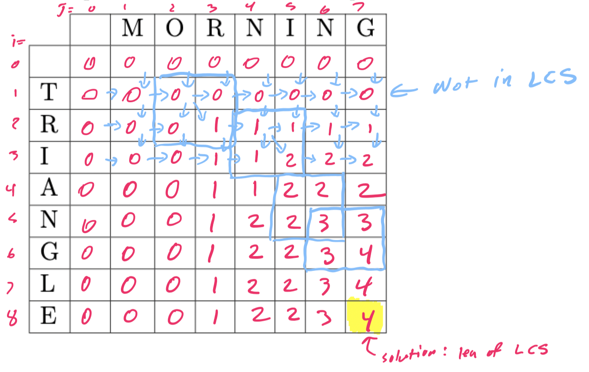

# Dynamic programming (part 2)

## Warm-up exercise

> A *subsequence* of a given sequence is just the given sequence with zero or more elements left out.
> Given two sequences $X$ and $Y$, we say that a sequence $Z$ is a *common sequence* of $X$ and $Y$ if $Z$ is a subsequence of both $X$ and $Y$.
> For example, the word "eerie" is the longest common subsequence between the words "exercise" and "determine".
> Find the longest common subsequence that you can between the words "morning" and "triangle"

- 't' -> 'r' -> 'i' -> 'a' -> 'n' -> 'g' -> 'l' -> 'e'
- 'm' -> 'o' -> 'r' -> 'n' -> 'i' -> 'n' -> 'g'

The longest common subsequence is: 'r' -> 'i' -> 'n' -> 'g'

## Longest common sequence

### Problem statement

Given two sequences $X$ and $Y$, we say that a sequence $Z$ is a *common sequence* of $X$ and $Y$ if $Z$ is a subsequence of both $X$ and $Y$. Our goal is to find the **maximum length** common sequence

| $X$ | $Y$ | Longest Common Subsequence | Length |
| --- | --- | --- |:---:|
| complete | continue | cote | 4 |
| exercise | determine | eerie | 5 |
| surface | character | race | 4 |
| toward | thousand | toad | 4 |

### Finding a recursive solution

```
LCS(s1, s2, n, m):
    if n == 0 or m == 0 then
        return 0
    if s1[n] == s2[m] then 
        return 1 + LCS(s1, s2, n - 1, m - 1)
    else
        return max(LCS(s1, s2, n - 1, m), LCS(s1, s2, n, m - 1))
```

- We have an overlapping subproblems issue here
- `LCS(n - 1, m)` must compute `LCS(n - 2, m)` and `LCS(n - 1, m - 1)`
- `LCS(n, m - 1)` must compute `LCS(n - 1, m - 1)` and `LCS(n, m - 2)`

### Finding an iterative solution

```
LCS(s1, s2):
    memo := [[-1 for i=0...n for j=0...m]]
    for i=0...s1.length do
        memo[i][0] = 0
    for j=0...s2.length do
        memo[0][j] = 0

    for i=1...s1.length do
        for j=1...s2.length do
            if s1[i] == s2[j] then
                memo[i][j] = 1 + memo[i-1][j-1]
            else
                memo[i][j] = max(memo[i-1][j], memo[i][j-1])

    return memo[n][m]
```

#### Execution example



#### Finding the LCS itself

```
FindLCS(s1, s2, memo):
    i := s1.length
    j := s2.length
    s := Stack()

    while i > 0 and j > 0 do
        if s1[i] == s2[j] then
            s.push(s1[i])
            i--
            j--
        else if memo[i][j] == memo[i-1][j]
            i--
        else
            j--

    while !s.empty() do
        /* Output s.top() */
        s.pop()
```