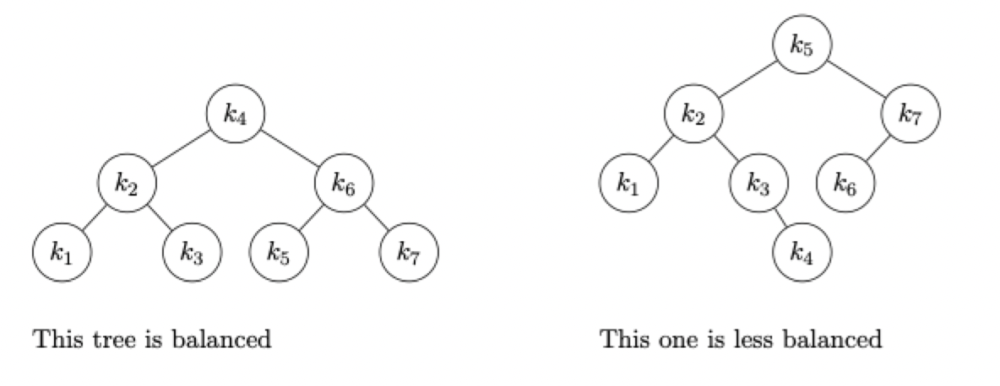
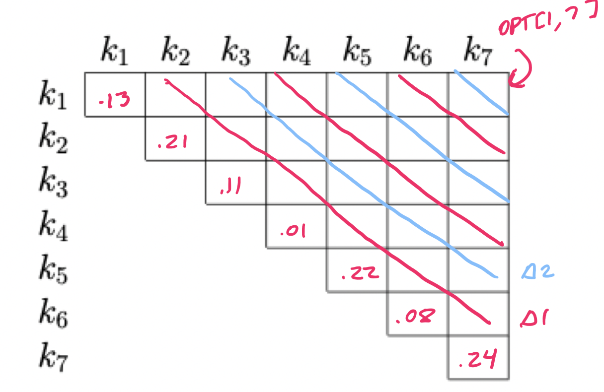
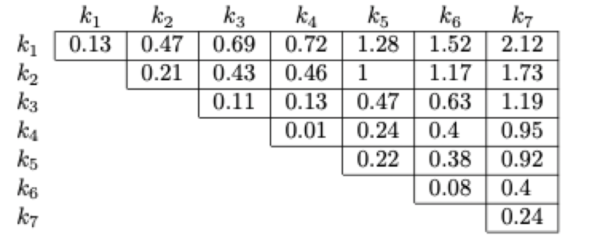

# Dynamic programming (part 5)

## Warm-up exercises

Suppose I am going to store some data. I will look up the data based on a key, which is an integer in the range $1 \dots n$. Suppose $n = 7$ and the probability I am going to lookup key $i$ is as follows

| $i$ | $p_{i}$ |
| --- | --- |
| 1 | 0.13 |
| 2 | 0.21 |
| 3 | 0.11 |
| 4 | 0.01 |
| 5 | 0.22 |
| 6 | 0.08 |
| 7 | 0.24 |

Suppose I decide I am going to store the data as a binary search tree. Here are two possible binary search trees with those keys



If I were to store the data in the left (more balanced) binary search tree, the *expected look-up cost* of an element is $2.69$. We can compute that number by $\sum_{i} d_{i}p_{i}$: this is the standard formula for expected value; here, the probability of a result is the likelihood I lookup key $i$ (given in the table above) and the cost of the outcome is the number of nodes we would have to examine in order to find key $i$: one examination for $k_{4}$, two for $k_{2}$ or $k_{6}$, and three for the rest. That is,

$$
    0.13 * 3 + 0.21 * 2 + 0.11 * 3 + 0.01 * 1 + 0.22 * 3 + 0.08 * 3 + 0.24 * 3
$$

> Compute the expected look-up cost of the second (less balanced) binary search tree, above.

$$
    3 * 0.13 + 2 * 0.21 + 3 * 0.11 + 4 * 0.01 + 1 * 0.22 + 3 * 0.08 + 2 * 0.24 = 2.12
$$

## Offline optimal binary search trees

### A recursive start

Let's compute `OPT(p, i, j)` which is going to be the *cost* of the optimal binary search tree consisting of keys $i$ through $j$ (inclusive). If this is called  with $j < i$, we consider this a null tree and return 0 (treat this as the base case).

```
OPT(i, j):
    if j < i then
        return 0
    else if i == j then
        return p[i]
    else
        return min(OPT(i, r-1) + OPT(r+1, j) + sum(p[i:j]) for r in range(i, j))
```

- Which key(s) can be the root of a binary search tree consisting of keys $i$ through $j$?

$$
    i \le r \le j
$$

- Suppose $r$ is the root. What is the cost of the search tree, rooted at $r$, consisting of the keys $i$ through $j$?

$$
    OPT(i, r-1) + OPT(r+1, j) + \sum \limits_{k=i}^{j} p_{k}
$$

### An iterative finish

Let's use that information to create a dynamic programming algorithm. When we're done, we will use that information to construct the tree itself

```
opt_bst(p):
    memo := [[-1 for i=0...p.length] for j=0...p.length]
    for i=1...p.length do
        memo[i][i-1] = 0
        memo[i][i] = p[i]

    for delta=1...p.length - 1 do
        for i=1...p.length - delta do
            j = i + delta
            memo[i][j] = memo[i][j-1] + memo[i+1][j] + sum(p[r] for r in range(i, j))
```

The dynamic programming table before any are filled in. Any spaces that will remain unused are not pictured



The dynamic programming table after the program finishes

