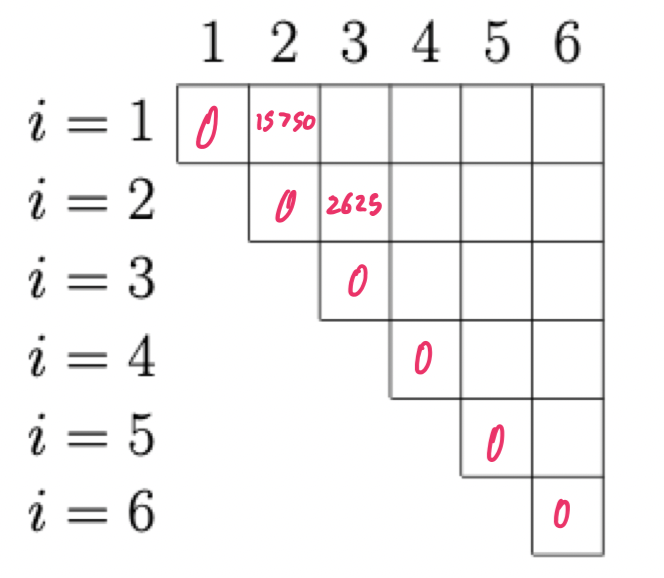
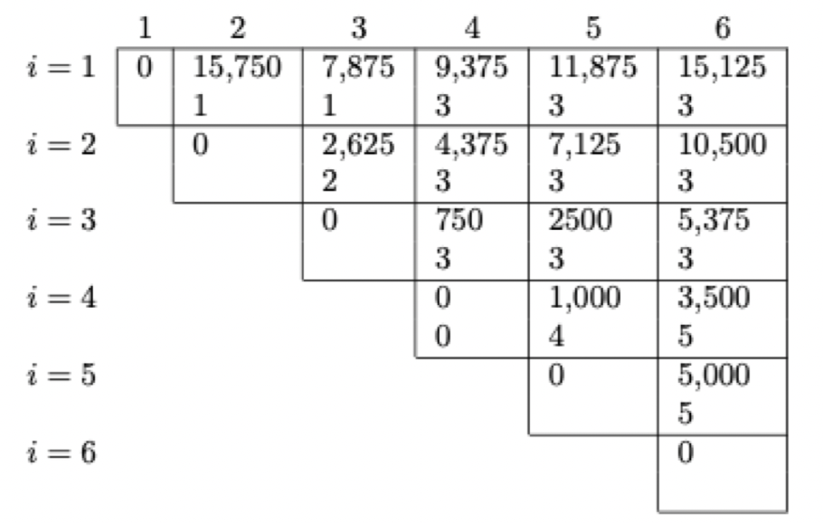

# Dynamic programming (part 6)

## Warm-up exercises

The following is a quick reminder of how we multiply two matrices $A$, and $B$. First, it must be the case that the number of columns in $A$ is equal to the number of rows in $B$. If $A$ is $p \times q$ and $B$ is $q \times r$, then the resulting matrix will be $p \times r$ and will require $pqr$ scalar multiplication to produce.

Suppose we wish to multiply three matrices $A_{1}A_{2}A_{3}$. The dimension of, respectively, are $10 \times 100$, $100 \times 5$, and $5 \times 50$. Both will produce the correct result, but one might take more work (scalar multiplications) than the other. We want to know if it would be better to multiply this as $((A_{1}A_{2})A_{3})$ or $(A_{1}(A_{2}A_{3}))$. That is, which of those options will require fewer *scalar* multiplications.

- How many scalar multiplications are required to multiply $A_{1}$ by $A_{2}$, and then multiply the result by $A_{3}$?

| Expression | Cost |
| --- | --- |
| $A_{1} * A_{2}$ | 5000 multiplications |
| $(A_{1} * A_{2}) * A_{3}$ | 2500 multiplications |
| Total | 7500 multiplications |

- How many scalar multiplications are required to multiply $A_{2}$ by $A_{3}$, and then multiply the result by $A_{1}$?

| Expression | Cost |
| $A_{2} * A_{3}$ | 25000 multiplications |
| $A_{1} * (A_{2} * A_{3})$ | 50000 multiplications |
| Total | 75000 multiplications |

## Matrix chain multiplication

### Problem statement

Suppose we wish to compute the product of $n$ matrices: $A_{1}A_{2}\dots A_{n}$. Because matrix multiplication is associative, any parenthsization of this expression will yield the same result. We say a product of matrices is **fully parenthesized** if it either a single matrix or the product of two fully parenthesized matrix products, surrounded by parentheses. For example, if $n = 4$, we can fully parenthesize the product 5 ways 

1) $(A_{1}(A_{2}(A_{3}A_{4})))$
2) $(A_{1}((A_{2}A_{3})A_{4}))$
3) $((A_{1}A_{2})(A_{3}A_{4}))$
4) $((A_{1}(A_{2}A_{3}))A_{4})$
5) $(((A_{1}A_{2})A_{3})A_{4})$

**For this problem, we are looking into deciding which order to multiply the matrices; the actual multiplications of them is not being done here.**

**Input:** If we are to multiply $n$ matrices, we need only the relative dimensions. We know that $A_{i}$'s columns must be equal to the number of rows in $A_{i+1}$ for our input to be valid, so we need only to know the number of rows in each matrix, plus the number of columns in $A_{n}$. The rows in each matrix are equal to the number of columns in the previous matrix

Thus our input is just a list of $n + 1$ positive integers: $d_{0}d_{1}\dots d_{n}$, where matrix $i$ is of dimension $d_{i-1} \times d_{i}$ for $i$ in the range $1 \dots n$.

### Recursive start

Let's compute `OPT(i, j)`, which is going to be the *cost* (in scalar multiplications) of the optimal matrix chain multiplications to produce the product of matrices $i$ through $j$ (inclusive). If this is called with $j = i$, we consider this an existing matrix and return 0 (treat this as a base case)

```
OPT(i, j):
    if j <= i then
        return 0
    else
        return min(
            OPT(i, k - 1) + OPT(k + 1, j) + d[i - 1] * d[i] * d[j] for k in range(i, j)
        )
```

### Iterative finish

Let's use that information to create a dynamic programming algorithm. When we're done, we will use that information to construct the parenthesization itself

```
opt_order(d):
    memo := [[-1 for i=0...d.length] for j=0...d.length]
    for i=1...d.length do
        memo[i][i] = 0

    for delta=1...d.length - 1 do
        for i=1...d.length - delta do
            j = i + delta
            memo[i][j] = memo[i][r-1] + memo[r+1][j] + sum(d[r] for r in range(i, j))
```

The dynamic programming table before any are filled in. Any spaces that will remain unused are not pictured



The dynamic programming table after program finishes with example input $d = \{ 30, 35, 15, 5, 10, 20, 25 \}$

