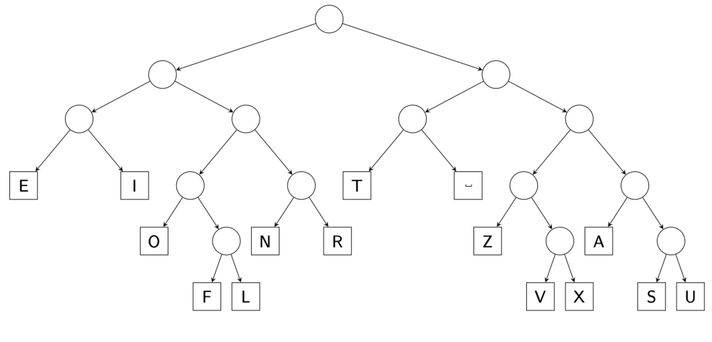

# Greedy algorithms (part 3)

## Huffman trees

### Encodings

Computers read bits, not characters. We translate each character to the string of bits which a computer can understand. First, think about what would be a good encoding Then, identify problems and inefficiencies with the following encodings

| character | encoding |
|:---:|:---:|
| a | 0000 |
| b | 0001 |
| c | 0010 |
| ... | ... |
| z | 11001 |

- Extra meaningless sequences
- Constant length requires more memory for storage

| character | encoding |
|:---:|:---:|
| a | 0 |
| b | 1 |
| c | 00 |
| d | 01 |
| e | 10 |
| ... | ... |

- Variable length saves space
- Easy to corrupt

### Prefix trees

Consider representing a character encoding with a binary tree

Lets say a message is compressed as a binary string. A `0` in the string means go to the left child, while a `1` means go to the right child. If we have reach a leaf node, we decompress the character and return to the root of the binary tree

- `m = 1100010010010111000100100`
    - `1100` -> 'Z'
    - `0100` -> 'O'
    - `100` -> 'T'
    - `101` -> ' '
    - `1100` -> 'Z'
    - `0100` -> 'O'
    - `100` -> 'T'
- `m = "ZOT ZOT"`

How would the message "ANTEATERS" be encoded using the tree above?

- `m = "ANTEATERS"`
    - 'A' -> `1110`
    - 'N' -> `0110`
    - 'T' -> `100`
    - 'E' -> `000`
    - 'A' -> `1110`
    - 'T' -> `100`
    - 'E' -> `000`
    - 'R' -> `0111`
    - 'S' -> `11110`
- `m = 111001101000001110100000011111110`

### Problem statement

Today's problem is as follows. We are given a text document; each letter $i$ has a frequency $0 \le f_{i} \le 1$ with $\sum_{i} f_{i} = 1$. Our goal is to encode the text in such a way that each letter's code is a prefix of another code. Let $b_{i}$ be length of the encoding for letter $i$. Our goal is to find a valid encoding that minimizes $\sum_{i} f_{i}b_{i}$

### A greedy heuristic to generate prefix trees

Suppose we want to encode a document with a prefix code that has the following frequencies, further suppose we have to do so via a binary tree

| letter $x$ | frequency $f_{x}$ |
|:--- |:--- |
| F | 21% |
| I | 18% |
| A | 6% |
| T | 5% |
| L | 23% |
| U | 12% |
| X | 15% |

Where should the letters go in order to minimize the average bit length of a compressed message?

What would a Huffman tree for "engineering useless rings" look like?

