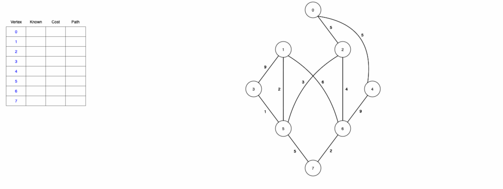
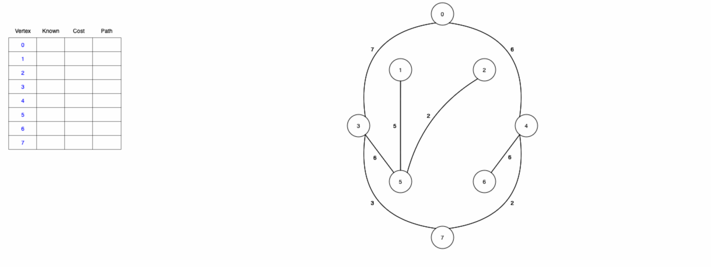

# Greedy algorithms (part 5)

## Warm-up exercise

Recall the **Dijkstra's algorithm** takes as input a weighted graph with positive edge weights and a designated vertex $s$ to signify the "starting point". The output is a *tree* such that the unique path from $s$ to any other vertex $v$ in the tree the shortest (lowest cost) path in the original graph

```
shortest_path(start_vertex, graph):
    for each vertex v in graph do
        intree[v] := false
        parent[v] := null
        dist[v] = inf

    while some(intree[u] == false) do
        intree[u] := tree
        for each vertex v such that u -> v exists do
            if dist[v] > dist[u] + cost(u, v) then
                dist[v] = dist[u] = cost(u, v)
                parent[v] = u
```



## Prim's algorithm for minimum spanning trees

### Problem statement

Given a graph $G$, a **spanning tree** is a subgraph of $G$ which is a tree containing every vertex of $G$. The **minimum spanning tree** is a subset of the edges which form a tree on the original nodes such that the sum of the edge weights chosen is *minimized*.

Note that while every connected weighted graph has a minimum spanning tree, it is not the case that every connected weighted graph has a *unique* minimum spanning tree

### The cut property

For any subset of vertices $S$, let $e$ be the minimum cost edge with exactly one endpoint in $S$. The minimum spanning tree *must* contain $e$. Using the cut property, we can determine which edges constitute a minimum spanning tree in a given graph.

### The cycle property

Suppose a minimum spanning tree $T$ does not contain the minimum cost edge $e$ with $e$ greater than any edge in a cycle with $c \in T \cup \{ e \}$. For sake of comparison, suppose that the cycle has edge $f$ such that $w_{e} < w_{f}$. Then $T - \{ f \} \cup \{ e \}$ is a spanning tree with a cost that is strictly less than $T$.

### Building a minimum spanning tree

