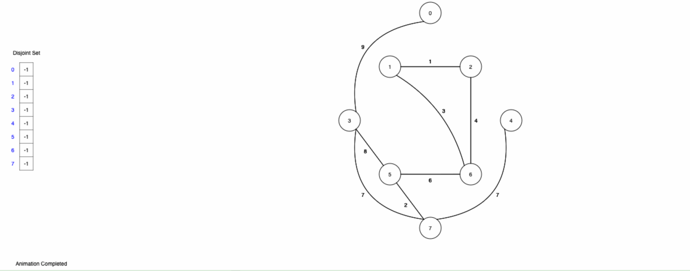

# Greedy algorithms (part 6)

## Kruskal's algorithms

```
kruskals(graph):
    /* sort edges in order by cost */
    tree := MST()
    e := /* Pick edge u -> v */
    if /* u and v are not connected */ then
        tree.add(e)
```

### The union-find data structure

For small enough graphs, we, as humans, can look at it and see if the endpoints were already in the same connected component. If we wanted to write this is as a computer program, we need to track the following information

1) Initially, all vertices are their own connected components
2) Need to efficiently check if two vertices are in the same connected component, even if those two vertices were never explicitly merged
3) Need to efficiently merge two connected components, and all the vertices therein

```
union(a, b):
    x := find(a)
    y := find(b)
    if x != y then
        x.parent = y

find(a):
    if a.parent != null then
        return find(a.parent)
    return a
```

- `find()` is $O(\log n)$
- `union()` is $O(\log n)$


### MST with union-find



## Path compression

### Implementation

- Set the parent pointer to the root instead of its immediate parent
- This causes the worse case of `find` to be the same as the best case
- Saves time on successive calls to `find`

### Analysis

- Let $k$ be the number of operations
- Total time is $O(k \, \alpha \, (k))$
- $\alpha$ is known as the inverse Ackermann function. It grows slowly enough to be considered constant