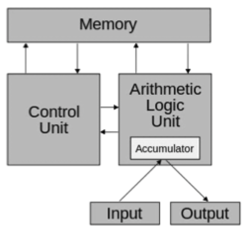

# Studying programming languages

## Language evaluations

### Studying programming languages

- Increase capacity to express ideas
- Improve background fro choosing appropriate language
- Increase ability to learn new languages
- Understand language implementation
- Better use of languages you already know
- Advance computing to better languages

### Programming domains

- Scientific applications
- Business applications
- Systems programming
- Artificial intelligence
- Web software
- Mobile applications
- Robotics
- Avionics and automotive systems

### Evaluation criteria

- Reliability
    - Writability
        - How natural is it to express an action
        - How much text is needed to express an action
    - Readability
        - How easy is it to understand and follow the program
    - Error detection and recovery
- Maintainability
    - Readability: aids in understanding to make a modification
    - Modifiability: symbolic constants, data abstractions, and polymorphism
- Target code efficiency
    - Machine oriented constructs
    - Compiler optimizations
- Cost
    - Training programmers
    - Compilation time
    - Execution time
    - Compiler cost
    - Maintenance cost

## Language design

### Influences on design

- Computer architecture



- Programming methodologies
    - Structured programming (no `goto`)
    - Symbolic applications (AI)
    - Data abstractions (classes)
    - Object orientation (polymorphism)
- Programmer efficiency
    - Computers are cheap
    - People are not...
- Programming paradigms

### Trade-offs

- Speed vs. reliability
- Writability vs. readability
- Flexibility vs. safety

### Implementation methods

- Compilation: source code is translated into a fully executable file
- Interpretation: source code is read as-is and executed accordingly
- Hybrid: source code is translated into byte code which is executed on a virtual machine

### Programming environments

- Non-integrated
    - A linux file system
    - Simple text editor
    - Simple debugger
    - Dedicated compiler or interpreter program
- Integrated
    - Fully immersive development environment
    - Includes all necessary tools to build applications
    - Delivered as IDEs like Visual Studio or xCode.

## Language evolution

- FORTRAN: scientific and engineering number crunching
- ALGOL: algorithmic
- LISP: lists with symbolic processing
- APL: powerful array and matrix processing with Greek
- COBOL: business applications
- SIMULA 67: classes and simulation
- BASIC: simple and interactive
- SNOBOL: strings and patterns
- PL/1: comprehensive general purpose
- Prolog: declarative, logic programming
- C: efficient systems programming, universally accepted
- Pascal: simple teaching language
- MODULA2: pascal with data abstraction
- Smalltalk 80: object oriented with window environment
- Eiffel: object oriented large systems
- Ada: large embedded defense software
- C++: object oriented general purpose
- Java: portability, security and simplicity
- Scripting languages
    - Perl: scripting using a combination of sh and awk
    - Ruby: OO scripting
    - Javascript: manipulating dynamic web documents
    - PHP: server-side web scripting
    - Python 2: system administration, small tasks and teaching
    - Python 3: a much cleaner language
- More OO languages
    - C#: Microsoft's answer to Java
    - Objective C: Apple's preferred language during the Steve Jobs era
    - Swift: Apple's preferred languages in the pose 2013 world

## Language abstractions

- Variables: an abstraction of computer memory
- Expression: `A + B` for `load A; load B; add A B;`
- Data type abstractions
    - Arrays, records and enumerations
    - Abstract data types like stacks, queues, vectors, and hashmaps
- Control abstractions
    - Statement level: `if`, `for`, and `switch`
    - Unit level: functions, coroutines, exceptions, threads
    - Polymorphism

### Understanding languages

- Language implementers: to implement compilers and interpreters correctly
- Language users: to use the language properly
- Textbook authors: to explain languages correctly

### Syntax

#### Syntax components 

- Sentence
    - A string of words (or lexemes)
    - Must follow a set of syntax rules (a grammar)
- Language
    - A set of all valid sentences (over some alphabet)
    - English, Python, C++, and Java are all valid languages
- Lexeme (or word)
    - An atomic unit in a language
    - A verb in English or the increment operator in C++
- Token
    - An abstract category for a set of lexemes
    - Identifiers for variable names and function names

#### Describing syntax

- Regular expressions
    - Typically map lexemes into tokens
    - `for` to match the reserved word for a for-loop
    - `[A-Z][_AZ0-9]*` to match identifiers
    - `[0-9]+` to match a unsigned integer literal
- Context free grammars
    - Typically group tokens into sentences
    - `E -> E '+' E`
    - `E -> E '*' E`
    - `E -> '(' E ')'`
    - `E -> Identifier`

### Semantics

- Semantics are more difficult to describe
- Often done in a natural language
- Non-formal techniques are often imprecise or incomplete
- A variety of formal techniques can be used

#### Operational semantics

- Give translation into an ideal machine language

```C
for (expr1; expr2; expr3) {
    /*statements*/
}
```

- Translates into

```asm
         expr1;
LoopTop: jcmp expr2, 0, LoopEnd
         ; statements
         expr3;
         jmp LoopTop
LoopEnd:
```

#### Axiomatic semantics

- Use predicate calculus to describe constraints
- State preconditions before each statement
- State post-conditions after each statement
- Can be used to "prove" correctness of a program
- Not very useful for human understanding

#### Denotational semantics

- Match objects denote meaning of language constructs
- Recursive functions convert language entities into these objects
- Most formal technique, but too mathematical for most humans

## Studying the Java programming language

### The `LinkedList` class

- The linked list will follow the following interfaces

```Java
public class LinkedList {
    ListNode head;
    public LinkedList() {
        head = null;
    }
    public void add(Object x);
    public int length();
    public boolean isEmpty();
    public java.util.Enumerations elements();
    public String toString();
}
```

- The list will be based on the following representations for list elements

```Java
class ListNode {
    Object info;
    ListNode next;

    ListNode(Object info, ListNode next) {
        this.info = info;
        this.next = next;
    }
}
```

### The `LinkedList.add(x)` method

```Java
public class LinkedList {
    ...
    public void add(Object x) // Whose head is it?
    {
        head = new ListNode(x, head); // added to the front
    }
}
```

### The `LinkedList.length()` method

```Java
public class LinkedList {
    ...
    public int length() {
        int n = 0;
        while (p = head != null) {
            n++;
            p = p.next;
        }
        return n;
    }
}
```

- This implementation results in a linear time performance
- If we stored the length of the list as an extra member variable, the method could be reformed as

```Java
public class LinkedList {
    ...
    public int length() {
        return this.sz;
    }
}
```

### The `LinkedList.isEmpty()` method

```Java
public class LinkedList {
    ...
    public boolean isEmpty() {
        return length() == 0;
    }
}
```

### The `LinkedListEnumeration` class

```Java
public class LinkedList {
    public java.util.Enumeration elements() {
        return new LinkedListEnumeration(this);
    }

    class LinkedListEnumeration implements java.util.Enumeration {
        ...
    }
}
```

### The `LinkedList.toString()` method

```Java
public class LinkedList {
    ...
    public String toString() {
        String result = "";
        java.util.Enumeration e = elements();
        while (e.hasMOreElements()) {
            result += e.nextElement().toString() + " ";
        }
        return result;
    }
}
```

### Inheritance with the `LinkedList` class

```Java
public class MyList extends LinkedList {
    ...
    public static void main(String args[]) {
        LinkedList l = new LinkedList();
        l.add("hello");
    }
}
```