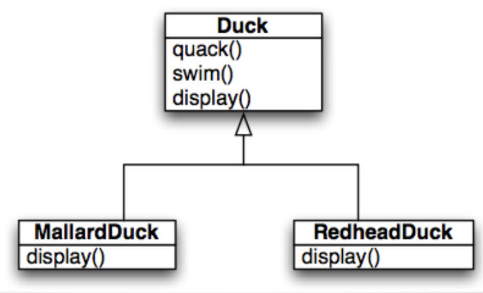
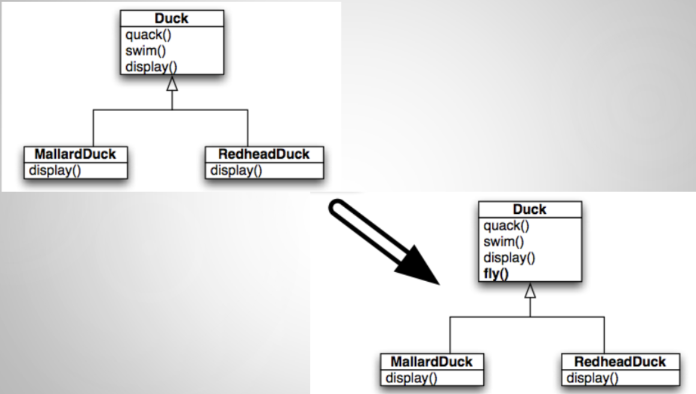
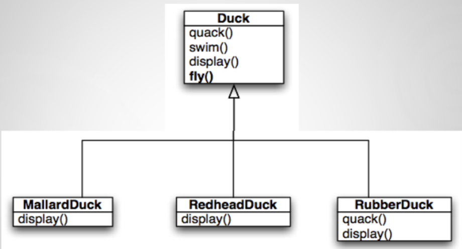
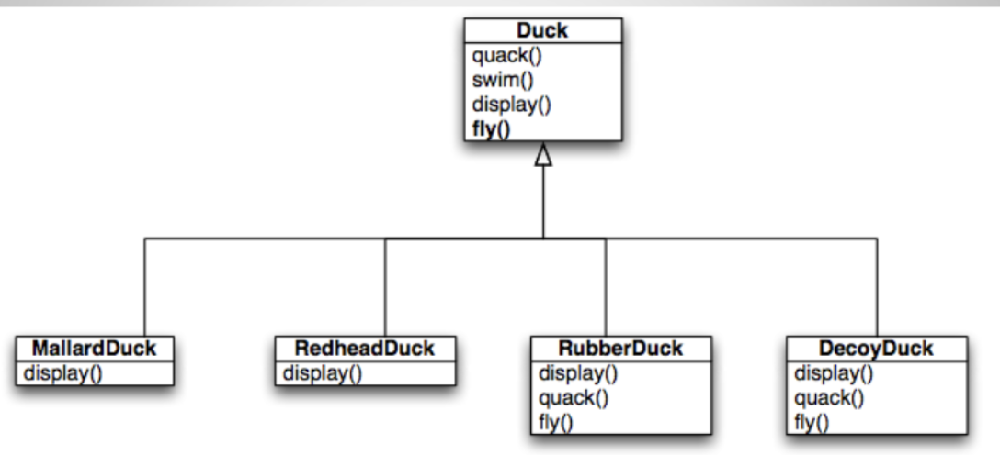
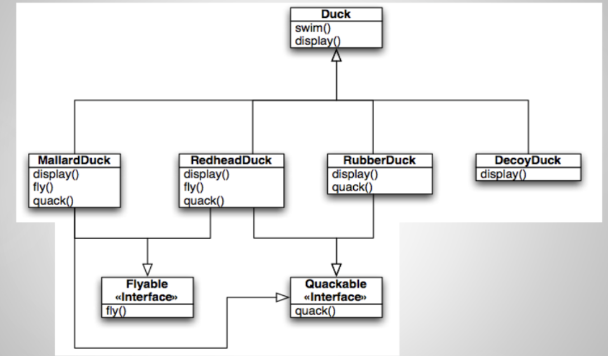
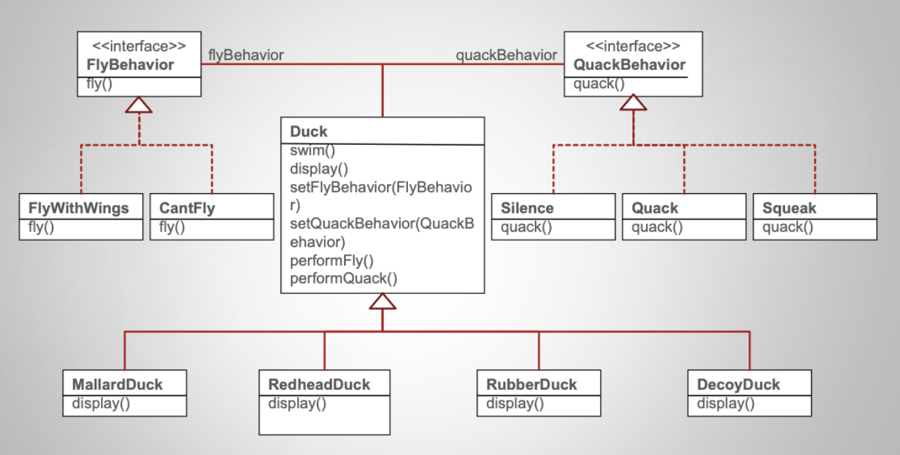
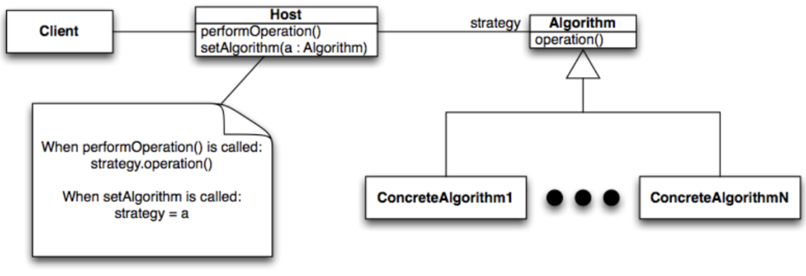
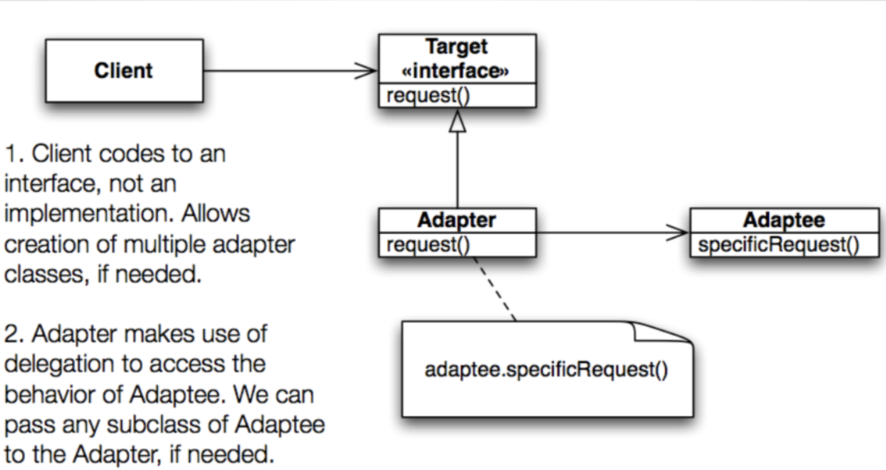

# Lecture 5

## Intro to design patterns

### What is a design pattern?

> Each pattern describes a problem which occurs over  
  and over again in our environment, and then describes  
  the core of the solution to that problem, in such a way  
  that you can use this solution a million times over,  
  without ever doing it the same way twice

### What makes up a design pattern?

- Name
- Problem
- Solution
- Consequences

### What is a *software* design pattern?

> Descriptions of communicating objects and classes that are  
  customized to solve a general design problem in a particular  
  context

### What makes up a *software* design pattern?

- Name and classifiction -> implementation
- Intent -> sample code
- Also known as -> known uses
- Motivation -> related patterns
- Applicability
- Structure
- Participants
- Collaborations
- Consequences

### Designed to avoid redesign caused by ...

- Creating an object by specifying a class explicitly
- Dependence on specific operations
- Dependence on hardware and software platforms
- Dependence on object representations or implementations
- Algorithmic dependencies
- Tight coupling
- Extending functionality by subclassing
- Inability to alter classes conveniently

### Design principles applied by patterns

1) Program to an interface, not an implementation
2) Favor compositions over inheritance
3) Find what varies and encapsulate it

### Patterns allow ...

- Reuse of solutions that have worked on the past
- Have a shared vocabulary around software design
- Reuse **experience** (but not necessarily code)
- Learn how to apply design principles to create maintainable, changeable designs

### Catalogue

| Creational | Structural | Behavioral |
|:----------:|:----------:|:----------:|
| **Abstract factory** | **Adapter** | Chain of responsibility |
| Builder | Bridge | Command |
| **Factory method** | Composite | Interpreter |
| Prototype | Decorator | Iterator |
| **Singleton** | **Façade** | Mediator |
| | Flyweight | Memento |
| | Proxy | Observer |
| | | State |
| | | **Strategy** |
| | | **Template method** |
| | | Visitor |

> **Bolded** patterns will be discussed in detail

## Strategy

### Example: "duck pond simulator"

#### Initial design

- Can show a wide variety of duck species swimming and quacking

- Client requests to allow ducks to fly

#### Adding ability to fly

#### Adding a rubber duck

#### Adding a wooden duck

#### Utilizing an interface

### Design tradeoffs

#### With inheritance

- Pro: code reuse
- Con: common behavior in root class is not so common

#### With interfaces

- Pro: specificity
- Con: no code reuse

### Design principles to the rescue

- Encapsulate what varies
    - Which behaviors vary between duck subclasses
- Result:
    - Fewer unintended consequence from code changes
    - More flexible code

### Basic idea

- Take any behavior that varies across Duck subclasses (`fly()` and `quack()`) and pull them out of `Duck`
- Create two sets of classes, one that implements fly behaviors and one that implements quack behaviors
- Code to an interface (`FlyBehavior` and `QuackBehavior`)
- Other classes can gain access to these behaviors and we can add additional behaviors without impacting other classes

#### "Coding to an interface"

- Can mean *both* an actual language interface or an abstract class
- Code to an interface implies that the object that is using the interface will have a variable whose type is the supertype and thus
    - Can point at any implementation of that supertype
    - And is shielded from their specific class names

#### Delegation

- Make `Duck` delegate its flying and quacking behaviors to these other  classes, rather than implementing this behavior internally
- Add two attributes that store the desired behavior and we’ll rename `fly()` and `quack()` to `performFly()` and `performQuack()`

#### Not completely decoupled

- Is `DuckSimulator` completely decoupled from `Duck` subclasses?
    - All of its variables are of type `Duck`
- No!
    - The subclasses are *still* coded to `DuckSimulator`
    - `Duck myDuck = new RubberDuck()`
- This **is** a type of coupling
    - This can be eliminated the the Factory design pattern

### Introducing the strategy design patterns

#### Definition

- Features the following design concepts/principles
    - Encapsulate what varies
    - Code to an interface
    - Favor delegation over inheritance
- How it works
    1) Defines a family of algorithms
    2) Encapsulates each one
    3) Makes them interchangeable
- Allows algorithms to vary independently from clients that use them

#### Structure

- Algorithm pulled out of host
- Client only makes use of the public interface of algorithm
- Client is not tied to concrete subclasses
- Client can change behavior by switching among various concrete algorithms

## Adapter

### Real world adapters

- AC power adapters
- Allow an american to use a european power outlet

### Software adapters

- Precondition: You are maintaining an existing system that makes use of a third-party class library from vendor A
- Stimulus: Vendor A goes belly up and corporate policy does not allow you to make use of an unsupported class library
- Response: Vendor B provides a similar class library but its interface is completely different from the interface provided by vendor A
- Assumptions: You don’t want to change your code, and you can't change vendor B's code
- Solution?: Write new code that adapts vendor B's interface to the interface expected by your original code

### Example: "turkey amongst ducks"

- An interloper wants to invade the simulator, say turkeys
- **But duck simulator does not know how to handel turkeys, only ducks**

#### Solution

1) Adapter class implements target interface (`Duck`)
2) Adaptee (`turkey`) is passed via constructor and stored internally
3) Calls by client code are delegated to the appropriate methods in the adaptee
4) Adapter is a full-fledged class
    - Could contain additional variables and methods to get its job done
    - Can be used polymorphically as a `Duck`

### Introducing the adapter pattern

#### Definition

- Converts the interface of a class into another interface that clients expect.
- Lets classes work together that couldn't otherwise because of incompatible interfaces.
- The client makes a request on the adapter by invoking a method from the target interface on it
- The adapter translates that request into one or more calls on the adaptee using the adaptee interface
- The client receives the results of the call and never knows there is an adapter doing the translation

#### Structure

