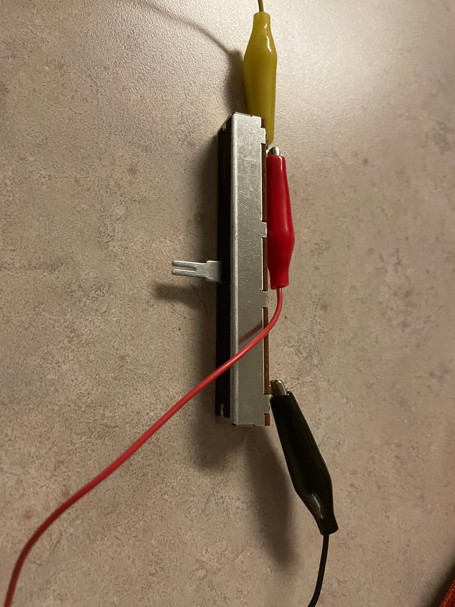
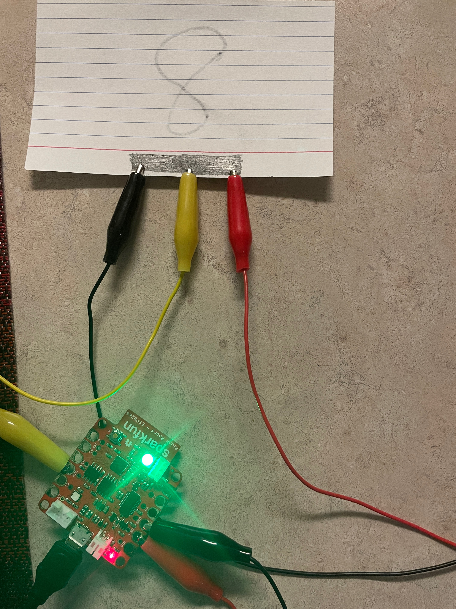

# Lecture 9

## Sensors

- A *sensor* is a device used to measure a property, such as pressure, position, temperature, or acceleration, and respond with feedback

### Hygrometers (humidity sensors)

- A humidity sensor (or hygrometer) senses, measures and reports both moisture and air temperature.
- The ratio of moisture in the air to the highest amount of moisture at a particular air temperature is called relative humidity. 
- Hygrometers are often found where humidity control is required (e.g., greenhouses, saunas, museums and incubators) or for collecting environmental data (e.g., weather forecasting).

### Types of hygrometers

- **Capacitive** humidity sensors measure relative humidity (0% to 100%) by placing a thin strip of metal oxide between two electrodes.
- **Resistive** humidity sensors utilize ions in salts to measure the electrical impedance of atoms.
- **Thermal** sensors conduct electricity based upon the humidity of the surrounding air. One sensor is encased in dry nitrogen while the other measures ambient air (the difference = the humidity.)

## Potentiameters

### Variable

#### Screenshot

#### Device

### DIY

