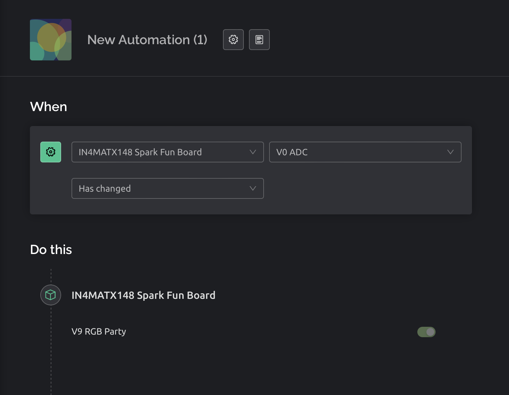
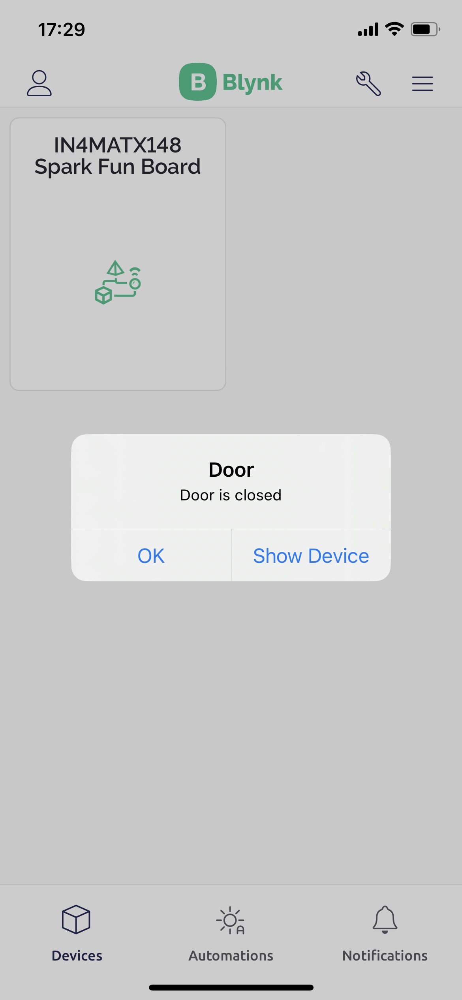

# Lecture 11

## Elements of a smart environment

1) Many heterogenous devices can modify the environment
2) Devices provide contextual information about the home, building, or city
3) Devices can interact to enable more complex applications
4) Ecosystems can self-organize and publish/manipulate complex data

### Smart cities

- Cities generate large amounts of data (from security cameras and environmental sensors) and already contain big infrastructure networks (like those controlling traffic lights).
- IoT projects aim to connect these up, and then add further intelligence into the system.
- Crack and Tilt Sensors with SIMs are installed on key infrastructure to monitor structural and environmental factors.
- Sensor data is sent across AT&T’s LTE network to IBM cloud. Secure web application provides a portal for customers.
- Customers access a web portal dashboard across multiple devices to take action based on location, condition, or operation type data shared via reports and alerts.

## How do IoT devices connect?

- WiFi / cellular data
- Bluetooth low energy
- Satellite
- Edge computing

### Security in a smart device

1) Endpoint protection
2) Patchable
3) Multi-faceted approach
4) Encrypted communications
5) Threat detection

### Security in IoT

- IoT's security track record has been **extremely poor.**
- Basics of security, like encrypting data in transit and at rest, are often overlooked in IoT devices.
- Many devices lack the capability to be patched, meaning they are permanently at risk.

## Automation part 1

### First automation screenshot

## Automation part 2

### Door open screenshot

### Door open hardware

### Door closed screenshot

### Door closed hardware

