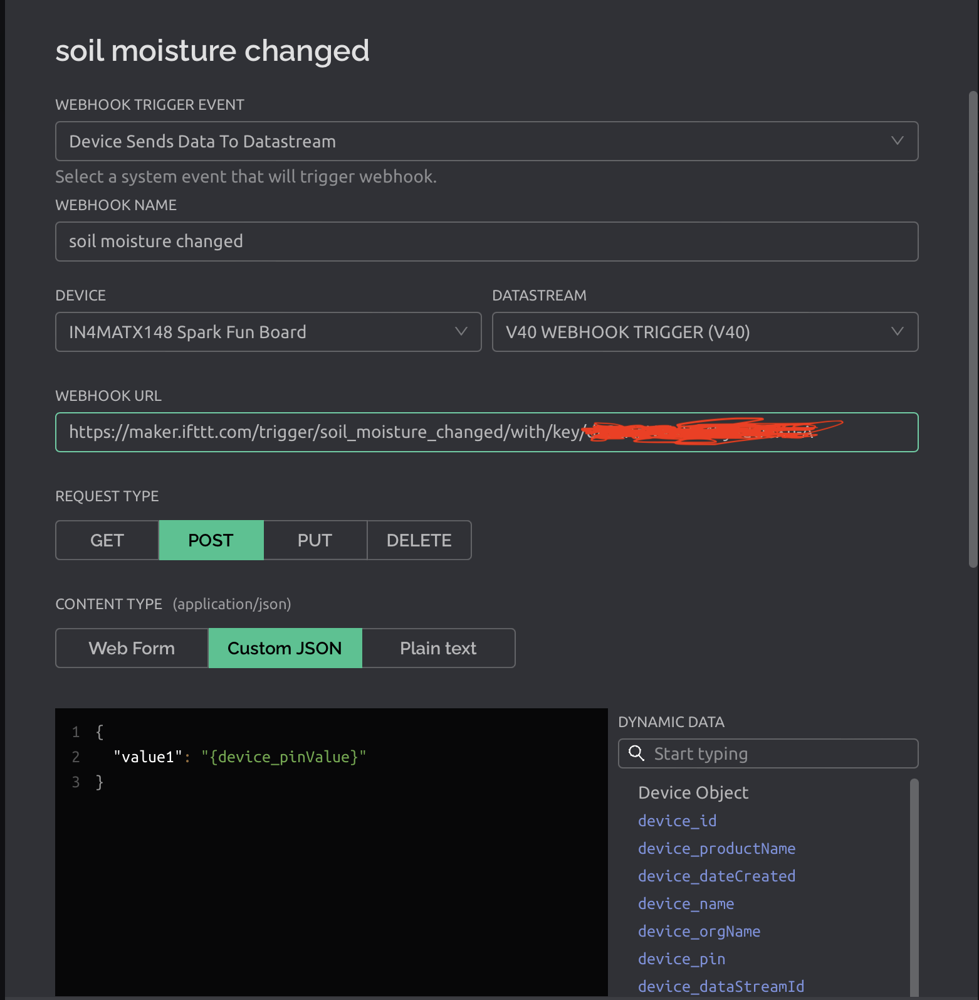

# Lecture 13

## Networks

- A collection of computers and devices that facilitate communication and allows sharing or resources
- Can be classified as a medium, protocol, or scale

## Transports

- Physical and wireless means to get data around
- Ethernet/Wifi
- Bluetooth and BTLE
- Cellular and satellite
- ZigBee & Z-wave
- LoRa & SigFox

## Protocols

- The languages machines use to talk to each other

### HTTP

- Asynchronous protocol
- One-way
- One client request and rules
- Data heavy; filled with headers and rules

### Rest

- An establish standard for transmitting data
- Used everywhere (both internally and externally)
- Support available in every modern computer and programming language

### XML

- Markup language similar to HTML
- Designed to be self-descriptive
- Comparatively complex and verbose

### JSON

- Lightweight data-interchange format based on JavaScript
- Preferred by IoT devices over XML

### MQTT

- Message Queue Telemetry Transport
- Allow bidirectional message passing
- Simple and lightweight
- Manages message asychronously

### CoAP

- Like REST, but cut down to be a light as MQTT
- Has REST interoperability

## Trust and IoT

- Enormous diversity of hardware, OS, software, and manufactureres make it difficult oto establish standard IoT security and privacy-protecting solutions
- Basic security measures does not protect against these IoT botnet attacks, privacy threats

### Building trust in IoT

1) Social engineering
    - Strong passwords
    - Frequent password updates
    - Role-based permissions
    - Following software update instructions
2) Attacks on hosted components
    - API authentication tokens
    - Role-based access
    - Application white listing to protect against "impersonation"
3) Hacked device software
    - Secure boot
    - Software updates
    - Secure package management
    - Integrity measurement architecture
    - Software isolation
4) Physical attack
    - File system encryption
    - Trusted platform modules
    - Remote attestation
5) Security misconfiguration
    - End-to-end, integrated security strategy at this stage

> There is no "magic bullet." Thinking about security before an IoT applicaiton is developed and deployed should be an integral part of the design

## Webhook

- Nearly all modern systems have their own Web/HTTP API

### Blynk Webhook

