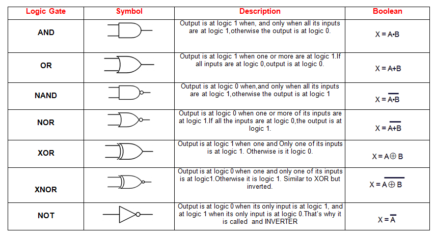

# Logic gates

## Common gates



## Using gates

### Build a "stairway" light switch

- Outputs
    - $1 \to \text{light on}$
    - $0 \to \text{light off}$

| x | y | F |   |
|---|---|---|---|
| 0 | 0 | 0 |
| 1 | 0 | 1 | $x\overline{y}$ |
| 1 | 1 | 0 |
| 0 | 1 | 1 | $\overline{x}y$ |

$$
    F(x, y) = x \oplus y = x\overline{y} + \overline{x}y
$$

```
     +----->+-----+
x----+      | AND |
   +-+----->+-----+--------->+----+
y--+ |                       | OR | ---->
   | +----->+-----+--------->+----+
   +------->| AND |
            +-----+
```

### Half-adder

| x | y | s | c |
|---|---|---|---|
| 0 | 0 | 0 | 0 |
| 0 | 1 | 1 | 0 |
| 1 | 0 | 1 | 0 |
| 1 | 1 | 0 | 1 |

$$
    \begin{cases}
        s = x \oplus y \\
        c = xy
    \end{cases}
$$

### Full adder

- $x + y + c$ using two half adders

```

c[i - 1]------------>+----+ ------> s
                     | HA |
               +---->+----+
               |          |
x[i]----->+----+          +---->+----+
          | HA |-------+        | OR | ------> c[i]
y[i]----->+----+       +------->+----+


```