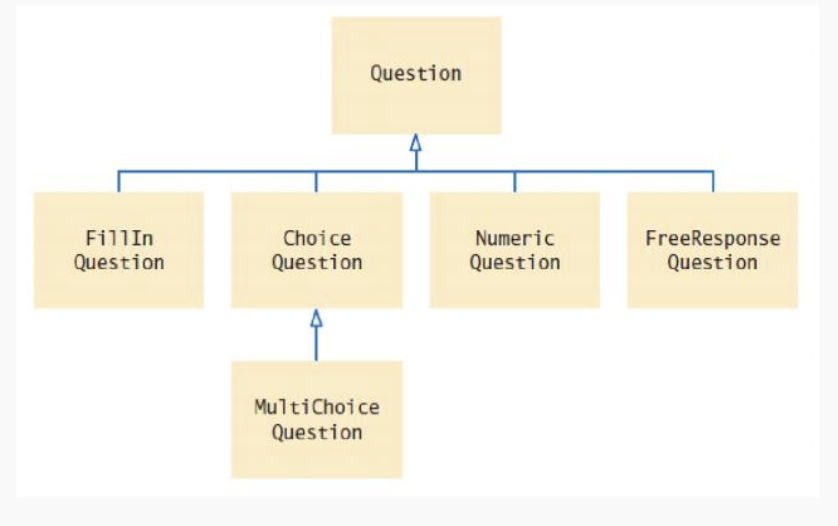
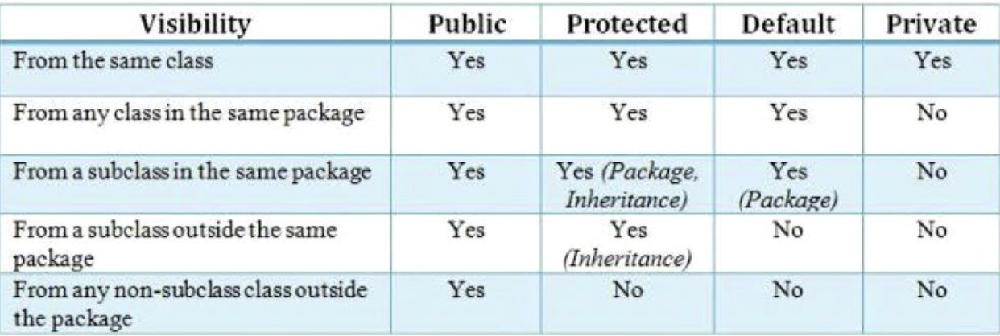
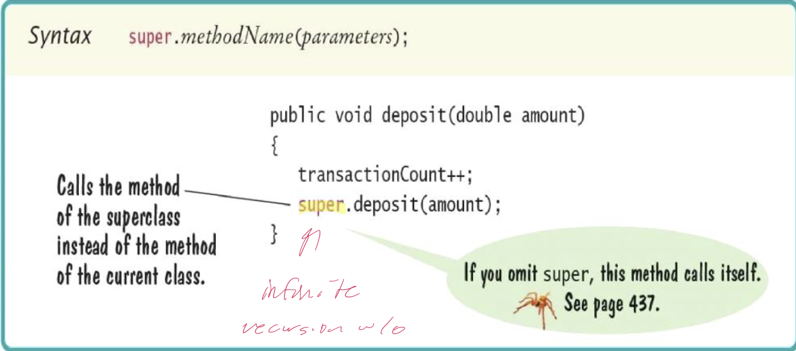
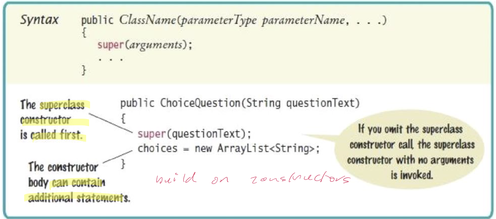
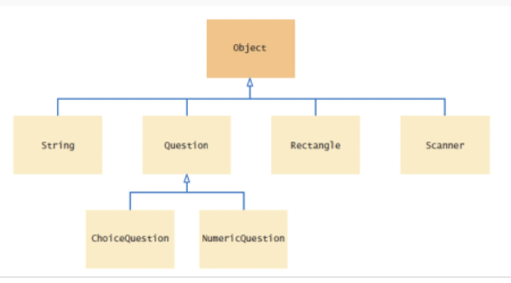

# Inheritance

## Inheritance hierarchies

- Inheritance: the relationship between a more general class (superclass) and a more specialized class (subclass)
- The subclass *inherits* data and behavior from the superclass
- Examples
	- Cars, motorcycles, trucks share the common traits of all vehicles
- Inheritance lets you reuse code instead of duplicating it
	- A subclass inherits its methods of the superclass
	- Because a car is a special kind of vehicle, we can use a `Car` object in algorithms that manipulate `Vehicle` objects
- The substitution principle
	- Inheritance is an "is-a" relationship
	- You can always use a subclass object when a superclass object is expected
	- A method that processes `Vehicle` objects can handle any kind of vehicle



## Implementing subclasses

- A subclass modifies another class by subclassing it, using the `extends` keyword
	- Java supports only single inheritance
- To get a `ChoiceQuestion` class, implement it as a subclass of `Question`
	- Specify what makes the subclass different from its superclass
	- Subclass objects automatically have the instance variables that are declared in the superclass
		- Only declare instance variables that are not part of the superclass objects
	- The subclass inherits all public methods from the superclass
		- Declare any methods that are **new** to the subclass
		- Supply **new** implementations for inherited methods if the inherited behavior is not appropriate by *overriding the method*

### Implementing the `ChoiceQuestion` subclass

- A `ChoiceQuestion` object differs from a `Question` object in three ways
	1) Its objects store the various choices for the answer
	2) There is a method for adding answer choices
	3) The display method of the `ChoiceQuestion` class shows these choices so that the respondent can choose one of them

```Java
public class ChoiceQuestion exends Question {
	// This instance variable is added to the subclass
	private ArrayList<String> choices;
	
	// This method is added to the subclass
	public void addChoice(String choice, boolean correct) { ... }

	// This method overrides a method from the superclass
	public void display() { ... }
}
```

- You can call the inherited (public) methods on a subclass object: `choiceQuestion.setAnswer("2");`
- But the private instance variables and methods of the superclass are inaccessible
- The `ChoiceQuestion` methods cannot directly access the instance variable answer
- `ChoiceQuestion` methods must use the public interface of the `Question` class to access its private data



- Adding the new method: `addChoice`

```Java
public void addChoice(String choice, boolean correct) {
	choices.add(choice);
	if (correct) {
		// Convert choices.size() to string
		String choiceString = "" + choices.size();
		setAnswer(choiceString);
	}
}
```

- `addChoice` method can not just access the `answer` variable in the superclass
- It must use the `setAnswer` method
- Invoke `setAnswer` on the implicit parameter

## Overriding methods

- If you are not satisfied with the behavior of an inherited method, you override it by specifying a new implementation in the subclass
- An overriding method can extend or replace the functionality of the superclass method
- The display method of the `ChoiceQuestion` class needs to
	- Display the question text
	- Display the answer choices
- Problem: `ChoiceQuestion`'s display method can't access the text variable of the superclass directly because it is private
- Solution: Call the `display` method of the superclass, by using the reserved word `super`

```Java
public void display() {
	// Display the question text
	super.display(); // OK
	//Display the answer choices
	...
}
```

- `super` is a reserved word that forces execution of the superclass method

### Calling a superclass method



### Constructor with superclass initializer



## Polymorphism

- Problem: to present both `Question` and `ChoiceQuestion` with the same program
- We do not need to know the exact type of the question
	- We need to display the question
	- We need to check whether the user supplied the correct answer
- The `Question` superclass has methods for displaying and checking
- We can simply declare the parameter variable of the `presentQuestion` method to have the type `Question`

```Java
public static void presentQuestion(Question q) {
	q.display();
	System.out.print("Your answer: ");
	Scanner in = new Scanner(System.in);
	String response = in.nextLine();
	System.out.println(q.checkAnswer(response));
}
```

- We can substitute a subclass object whenever a superclass object is expected

```Java
ChoiceQuestion second = new ChoiceQuestion();
...
presentQuestion(second); // OK to pass a ChoiceQuestion
```

- When the `presentQuestion` method executes
	- The object references stored in `second` and `q` refer to the same object. The object is of type `ChoiceQuestion`
- The variable `q` know less than the full story about the object to which it refers
- In the same way that vehicles can differ in their method of locomotion, polymorphic objects carry out tasks in different ways
- When the virtual machine calls instance method
	- It locates the method of the implicit parameter's class. This is called **dynamic method lookup.**
- Dynamic method lookup allows us to treat objects of different classes in a uniform way
- This features is called polymorphism
- We ask multiple object to carry out a task, and each object does so in its own way
- Polymorphism means "having multiple forms"
	- It alls us to manipulate objects that share a set of tasks, even though the tasks are executed in different ways

> The great thing objects is they can be replaced

## Abstract classes

- An *abstract class* is a placeholder in a class hierarchy that represents a generic concept
- An abstract class cannot be instantiated
- We use the modifier `abstract` on the class header to declare a class as abstract

```Java
public abstract class Whatever {
	// contents
}
```

- An abstract class often contains abstract methods with no definitions
- The `abstract` modifier must be applied to *each* abstract method
- An abstract class typically also contains non-abstract methods (with bodies)
- The `final` modifier must be applied to each method that may *not* be overridden in a subclass
- The child of an abstract class must override the abstract methods of the parent, or it too will be considered abstract
- The use of abstract classes is a design decision -- it helps us establish common elements in a class that is too general to instantiate

## `Object`: the cosmic superclass

- Every class defined without an explicit `extends` clause automatically extends `Object`
- The class `Object` is the direct of indirect superclass of every class in Java



### The `toString` method

- Returns a string representation of the object

```Java
Rectangle box = new Rectangle(5, 10, 20, 30);
String s = box.toString();
```

- `toString` is called whenever you concatenate a string with an object
- The compiler can invoke the `toString` method, because it knows that every object has a `toString` method
	- Every class extends the `Object` class which declares `toString`
- `Object.toString` prints the class name and the *hash code* of the object by default
- Override the `toString` method in your classes to yield a string that describes the object's state

```Java
public String toString() {
	return "BankAccount[balance=" + balance + "]";
}
```

### The `equals` method

- `Object.equals` method checks whether two objects have the same content
- The `==` operator tests whether two references are identical -- referring to the same object
- To implement the `equals` method for a `Stamp` class

```Java
public class Stampe {
	private String color;
	private int value;
	...
	public boolean equals(Object otherObject) {
		Stamp other = (Stamp) otherObject;
		return color.equals(other.color) && value == other.value;
	}
	...
}
```

- Cannot change parameter type of the `equals` method -- it **must** be `Object`
- Cast the parameter variable to the class `Stamp` instead
- After casting, compare the two Stamps
- The equals method can access the instance variables of any `Stamp` object since it is an instance method of the `Stamp` class
- When yo implement equals in a subclass, you should first call equals in the superclass to check whether the superclass instance variables match

```Java
public class CollectiableStamp extends Stamp {
	private int year;
	...
	public boolean equals(Object otherObject) {
		if (!super.equals(otherObject)) { return false; }
		if (otherOjbect instanceof CollectibleStamp) {
			CollectibleStamp other = (CollectibleStamp) otherObject;
			return year == other.getYear();
		}
		return false;
	}
}
```

### The `instanceof` operator

- It is legal to store a subclass reference in a superclass variable
- Sometimes you need to convert from a superclass reference to a subclass reference
- If you know a variable of type `Object` actually holds a `Question` reference, you can cast
- If reference refers to an object of an unrelated type, a "class cast" exception is thrown
- The `instanceof` operator tests whether an object belongs to a particular type