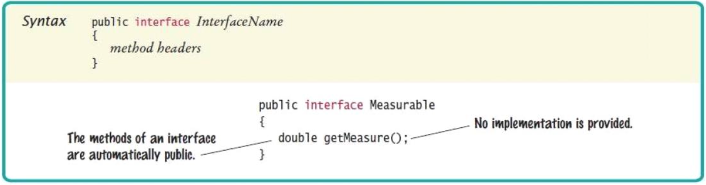
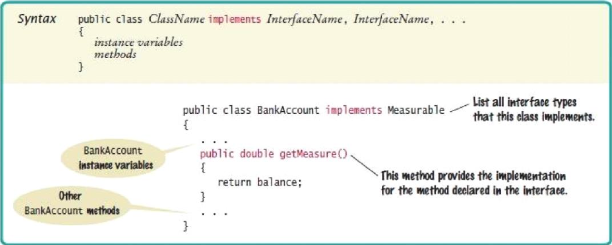

# Interfaces (part 1)

## Using interfaces for algorithm reuse

- **Interface types** are used to express common behavior as operations
- Interfaces make it possible to make a service available to a wide set of clients
- A restaurant serves only people: `public void serve(Person client)`
- Now it can serve anyone or anything that conforms to the `Customer` interface type: `public void serve(Customer client)`
	- `Customer` might have the methods `eat` and `pay`
	- If the classes `Person` and `Dog` conform to the interface, then you can pass objects of those classes to the `serve` method

### Defining an interface type

- Example: a method to compute the average of an array of `Object`s
	- The algorithm for computing the average is in the same in all cases
	- Details of measurement differ
- Goal: write one method that provides this service
- We can't call `getBalance` in one case and `getArea` in another
- Solution: all objects that want this service must agree on a `getMeasure` method
	- `BankAccount`'s `getMeasure` will return the balance
	- `Country`'s `getMeasure` will return the area
- Now we implement a single `average` method that computes the sum: `sum = sum.obj.getMeasure()`

- Problem: we need to declare a type of `obj`
- Need to invent a new type that describes any class whose objects can be measured
- An **interface type** is used to specify required operations

```Java
public interface Measurable {
	double getMeasure();
}
```

- A java interface type declares the methods but does not provide their implementations



- An interface type is similar to a class
- Differences between classes and interfaces
	- An interface type does not have instance variables
	- All methods in an interface type are abstract
	- All methods in an interface type are automatically public
	- An interface type has no constructor
- Implementing a reusable `average` method

```Java
public static double average (Measurable[] objects) {
	double sum = 0;
	for (Measurable obj: objects) {
		sum = sum + obj.getMeasure();
	}
	if (objects.length > 0) {
		return sum / objects.length;
	}
	else {
		return 0;
	}
}
```

- This method can be used for objects of any class that conforms to the `Measurable` type

### Implementing an interface type

- Use the `implements` reserved word to indicate that a class implements an interface type

```Java
public class BankAccount implements Measurable {
	...
	public double getMeasure() {
		return balance;
	}
}
```

- `BankAccount` objects are instances of the Measurable type: `Measurable obj = new BankAccount(); // OK`
- A variable of type `Measurable` holds a reference to an object of some class that implements the `Measurable` interface
- `Country` class can also implement the `Measurable` interface

```Java
public class Country implements Measurable {
	public double getMeasure() {
		return area;
	}
}
```

> Use interface types to make code more reusable
> Use interface types to **reduce coupling** and **minimize dependencies**



## Comparing interfaces and inheritance

- A class can implement more than one interface
- A class can only extend **one** class
- An interface specifies the behavior that an implementing class should supply
- A superclass provides some implementation that a subclass inherits

> Develop interfaces when you have code that processes objects of different classes in a common way

### Similarities

| Classes | Interfaces |
| ------- | ---------- |
| A superclass provides a secondary data type to objects of its subclasses | An interface provides a secondary data type to objects of classes that implement that interface |
| An abstract class cannot be instantiated | An interface cannot be instantiated |
| A concrete subclass of an abstract must define all the inherited abstract methods | A concrete class that implements an interface must define all the methods specified by the interface |
| A class can extend another class. A subclass can add methods and override some of its superclass's methods | An interface can extend another interface (called its *superinterface*) by adding declarations of abstract methods |

### Differences

| Classes | Interfaces |
| ------- | ---------- |
| A class can extend only one class | A class can implement any number of interfaces |
| A class can have fields | An interface cannot have fields (except, possibly, some public static final constants) |
| A class defines its own constructors (or gets a default constructor) | An interface has no constructors |
| A concrete class has all its method defined. An abstract class usually has one or more abstract methods | All methods declared in an interface are abstract |
| Every class is a part of a hierarchy of classes with `Object` at the top | An interface may belong to a small hierarchy of interfaces, but this is not very common |

## Working with interface types

### Converting from classes to interfaces

- You can convert from a class type to an interface type, provided the class implements the interface
- A `Measurable` variable can refer to an object of the `BankAccount` class because `BankAccount` implements the `Measurable` interface

```Java
BankAccount account = new BankAccount(1000);
Measurable meas = account; // OK
```

- Method calls on an interface reference are polymorphic -- the appropriate method is determined at run time

### Casting from interfaces to classes

- Method to return the object with the largest measure

```Java
public static Measurable larger(Measurable obj1, Measurable obj2) {
	if (obj1.getMeasure() > obj2.getMeasure()) {
		return obj1;
	}
	else {
		return obj2;
	}
}
```

- Returns the object with the larger measure, as a `Measurable` reference

```Java
Country uruguary = new Country("Uruguay", 176220);
Country thailand = new Country("Thailand", 513120);
Measurable max = larger(uruguay, thailand);
```

- You know that `max` refers to a `Country` object, but the compiler does not
- Solution: cast

```Java
Country maxCountry = (Country) max;
String name = maxCountry.getName();
```

- You need a cast to convert from an interface type to a class type
- If you are wrong and `max` does not refer to a `Country` object, the program throws an exception at runtime
- In a `Person` object is actually a `Superhero`, you need a cast before you can apply any `Superhero` methods