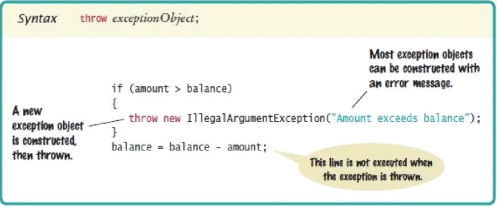
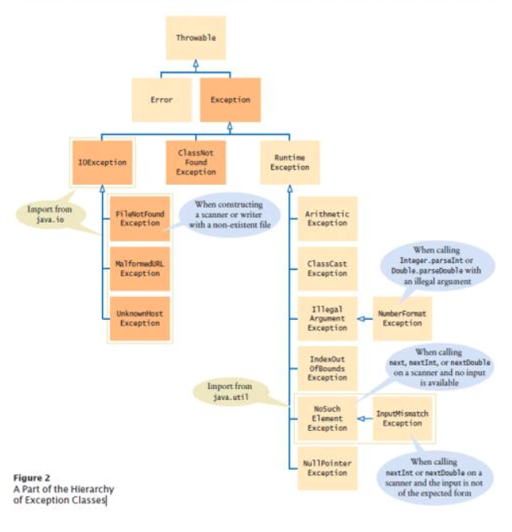
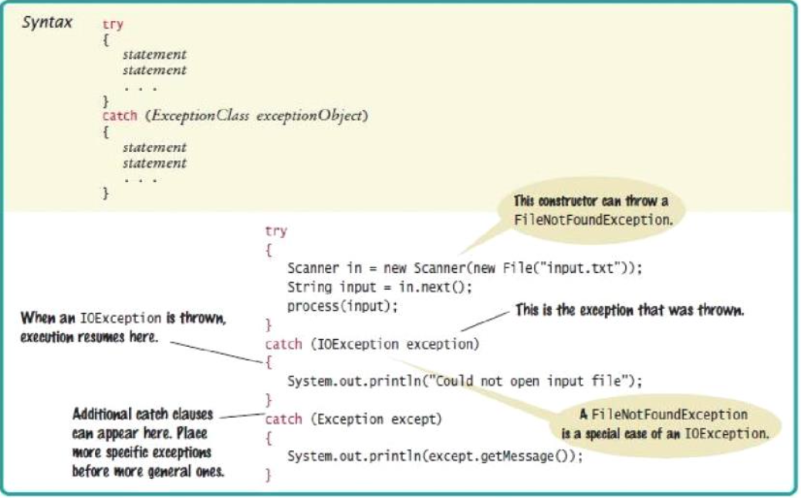
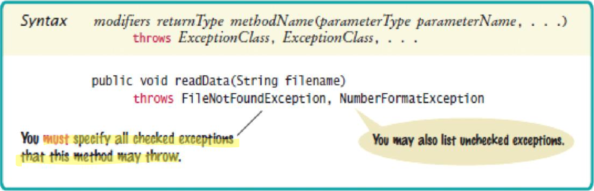

# Input/Output and exception handling

## Reading and writing text files

## Text input and output

### Reading text files

- Use the `Scanner` class for reading text files
- To read from a disk file
	1) Construct a `File` object representing the input file: `File inputFile = new File("input.txt");`
	2) Use this `File` object to construct a `Scanner` object: `Scanner in = new Scanner(inputFile);`
	3) Use `Scanner` methods to read data from the file

```Java
while (in.hasNextDouble()) {
	double value = in.nextDouble();
	// Process value
}
```

### Writing text files

- To write to a file, construct a `PrintWriter` object: `PrintWriter out = new PrintWriter("output.txt");`
	- If file already exists, it is emptied before the new data is written into it
	- If file doesn't exists, an empty file is created
	- Use `print` and `println` to write into a `PrintWriter`

```Java
out.println("Hello, World!");
out.printf("Total: %8.2f\n", total);
```

- You **must** close a file when you are done processing it

```Java
in.close();
out.close();
```

### `FileNotFoundException`

- When the input or output file doesn't exist, a `FileNotFoundException` can occur
- To handle the exception, label the `main` method like this

```Java
public static void main(String[] args) throws FileNotFoundException
```

## Text input and output

- The `next` method of the `Scanner` class reads a string that is delimited by white space

```Java
while (in.hasNext()) {
	String input = in.next();
	System.out.println(input);
}
```

- The `next` method returns any sequence of characters that is not white space
- **White space** includes
	- spaces
	- tab characters
	- newline characters
- When `next` is called
	- Input characters that are white space are consumed -- removed from the input
	- The first character that is **not** white space becomes the first character of the word
	- More characters are added until
		- Either another white space character occurs
		- Or the end of the input file has been reached
- If the end of the input file is reached before any character was added to the word, a `NoSuchElementException` occurs

### Delimiters

- You don't have to use white space as the delimiter between words
- To read just words and discard anything that isn't a letter
	- Call `useDelimiter` method of the `Scanner` class, passing it in a regular expression

```Java
Scanner in = new Scanner();
in.useDelimiter("[^A-Za-z]+");
```

### Reading characters

- To read one character at a time, set the delimiter pattern to the empty string

```Java
Scanner in = new Scanner();
in.useDelimiter("");
```

- Now each call to `next` returns a string consisting of a single character
- To process all characters

```Java
while (inn.hasNext()) {
	char ch = in.next().charAt(0);
	// Process ch
}
```

### Reading lines

- The `nextLine` method reads a line of input and consumes the newline character at the end of the line
- The `hasNextLine` method returns `true` if there are more input lines, `false` when all lines have been read

```Java
while (in.hasNextLine()) {
	String line = nextLine();
	// Process line
}
```

### Scanning a string

- Sometimes it is easier to construct a new `Scanner` object to read the characters from a string

```Java
Scanner lineScanner = new Scanner(line);
String coutryName = lineScanner.next();
while (!lineScanner.hasNextInt()) {
	coutntryName = countryName + " " + lineScanner.next();
}
int populationValue = lineScanner.nextInt();
```

### Converting strings to numbers

- If a string contains the digits of a number
- Use the `Integer.parseInt` or `Double.parseDouble` method to obtain the number value
- The string must not contain spaces or other non-digits. Use `trim`

### Avoiding errors when reading numbers

- If the input is not a properly formatted number when calling `nextInt` or `nextDouble` an `InputMismatchexception` occurs
- If there is no input at all when you call `nextInt` or `nextDouble` a `NoSuchElementException`
- To avoid exceptions, use the `hasNext...` methods

```Java
if (in.hasNextInt()) {
	int value = in.nextInt();
}
```

### Mixing number, word, and line inputs

- The `nextInt`, `nextDouble`, and `next` methods do **not** consume the white space that follows the number or word
- This can be a problem if you alternate between the next methods

### Formatting output

- There are additional options for the `printf` method

| Flag | Meaning |
| ---- | -------- |
| `-` | left alignment |
| `0` | show leading zeroes |
| `+` | show a plus sign for positive numbers |
| `(` | Enclose negative numbers in parentheses |
| `,` | show decimal separators |
| `^` | Convert letters to uppercase |

- A format specifier has the following structure
	- The first character is a `%`
	- Next are optional "flags" that modify the format
	- Next is the field width, the total number of characters in the field (including the spaces used for padding), followed by an optional precision for floating-point numbers
	- The format specifier ends with the format type, such as `f` for floating-point values or `s` for strings

## Command line arguments

- You can run a Java program by typing a command at the prompt in the command shell window
	- Called **invoking the program from the command line**
- With this method, you can add extra information for the program to use
	- Called **command line arguments**
- Useful for automating tasks
- Your program receives command line arguments in the `args` parameter of the `main` method

```Java
public static void main(String[] args) { ... }
```

## Exception handling

### Throwing exceptions

- Exception handling provides a flexible mechanism for passing control from the point of error detection to a handler that can deal with the error
- When you detect an error condition, throw an exception object to signal an exceptional condition
- When an exception is thrown, method terminates immediately
- When you throw an exception, the normal control flow is terminated



### Exception classes



### Catching exceptions

- Every exception should be handled somewhere in your program
- Place the statements that can cause an exception inside a try block, and the handler inside a catch clause

```Java
try {
	String filename = ...;
	Scanner in = new Scanner(new File(filename));
	String input = in.next();
	int value = Integer.parseInt(input);
	...
}
catch (IOException exception) {
	exception.printStackTrace();
}
catch (NumberFormatException exception) {
	System.out.println(exception.getMessage());
}
```

- Three exceptions may be thrown in the try block
	- The `Scanner` constructor can throw a `FileNotFoundException`
	- `Scanner.next` can throw a `NoSuchElementException`
	- `Integer.parseInt` can throw a `NumberFormatException`
- If any of these exceptions is actually thrown, then the rest of the instructions in the try block are skipped
- If a `FileNotFoundException` is thrown
	- The catch clause for the `IOException` is executed because `FileNotFoundException` is a descendant of `IOException`
	- If you want to show the user a different message for a `FileNotFoundException`, you must place the catch clause before the clause for an `IOException`
- If a `NumberFormatException` is thrown
	- The second catch clause is executed
- A `NoSuchElementException` is not caught by any of the catch clauses
	- The exception remains thrown until it is caught by another try block
- Each catch clause contains a handler
- When you throw an exception , you can provide your own message string
- You should only catch those exceptions you can handle



### Checked and unchecked exceptions

- Exceptions fall into three categories
	1) Internal errors are reported by descendants of the type `Error`
	2) Descendants of `RuntimeException`
		- Indicates errors in your code
		- They are called **unchecked exceptions**
		- The compiler does not check whether you handle an unchecked exception
	3) All other exceptions are called **checked exceptions**
		- Indicate that something has gone wrong for some external reason beyond your control
		- The compiler checks that your program handles these exceptions

#### Checked exceptions

- The `throws` clause signals to the caller of your method that it may encounter the specified exception
- The caller must decide
	- To handle the exception
	- Or declare the exception may be thrown
- Throw early, catch late
	- Throw an exception as soon as a problem is detected
	- Catch it only when the problem can be handled



### Closing resources

- Resources that must be closed require careful handling, such as `PrintWriter`
- Use the try-with-resources statement

```Java
try (PrintWriter out = new PrintWriter(filename)) {
	writeData(out);
} // out.close() is always called
```

- If no exceptions occurs, `out.close()` is called after `writeData()` returns
- If an exception occurs, `out.close()` is called before exception is passed to its handler

### Designing you own exception types

- You can design your own exception types -- subclasses of `Exception` or `RuntimeException`

```Java
if (amount > balance) {
	throw new InsufficientFundsException (
		"Withdrawal of " + amount + " exceeds balance of " + balance
	);
}
```

- Make `InsufficientFundsException` an unchecked exception
	- Programmer could have avoided it by calling `getBalance` first
	- Extend `IllegalArgumentException`
- Supply two constructors for the class
	1) A constructor with no arguments (default)
	2) A constructor that accepts a message string describing the reason for the exception
- When the exception is caught, its message string can be retrieved
	- Using the `getMessage` method of the `Throwable` class