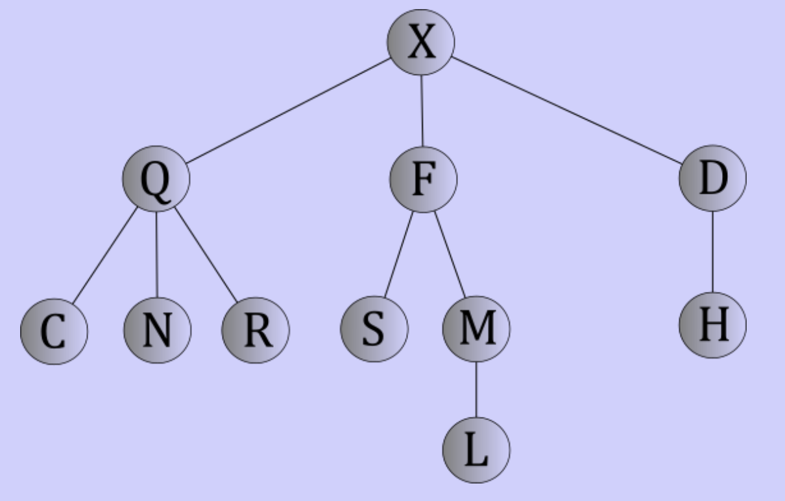

# General trees

## Trees

### Definition

> A tree is either
> 	- empty
> 	- a root node with 0 or more distinct subtrees

- Trees are hierarchical
- Each circle of a drawn tree is a node
- Parent and child relations
	- Represent by a line between two nodes
	- Each node has exactly one parent
	- Each node can have 0 or more children
	- Two nodes are sibling when they have the same parent
- Root is the only node with no parent
- Left nodes have 0 child nodes

### Terminology

- The **degree** of a node is how many children it has
	- Leaf nodes have degree 0
	- Other nodes can be 0 or more
- A **path** is a sequence of nodes where each not is the parent of the one that follows it
	- **Path length** is how many links to follow to get from beginning to end
	- One less that the number of nodes in the path
- The **level** or **depth** of a node is the length of the path from the root to that node
- The **height** of a tree is the height of the root (length of the longest path from the root to a leaf)
- Multiple trees in a group is called a **forest**

## Implementing

### The parent pointer implementation

- Each node knows its parent
- Array-based data structure
- Store in a order (can be random)
- Index to track parents
- Good for working upward a tree

### The list of children implementation

- Each node knows its children
- Nodes as objects
- Array based object to track pointers to children
- Empty array would mean a node is a leaf
- Good for working downward a tree

## Restricted trees

- General trees have no restriction on shape
- One node with huge number of children
- One node with one child recurring a lot
- Everything in between

### N-ary trees

> An N-ary tree of order N is either
> 	- Empty
> 	- A root node, along with exactly N disjoint subtree, each of which is an N-ary trees

- Limits the number of subtrees a node has
	- Binary trees: 0-2 subtrees per node
		- One subtree of each is called the left, the other is called the right
	- Ternary trees: 0-3 subtrees per node
	- Quaternary trees: 0-4 subtrees per node