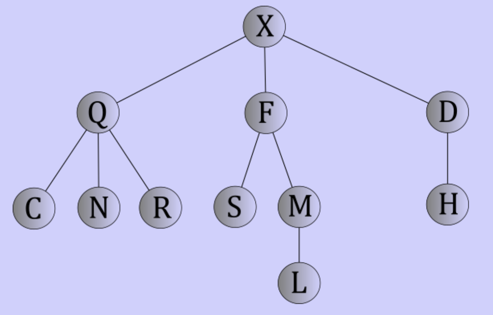

# Tree traversals

## Traversal algorithms

- An algorithm that visits every data element in a data structure exactly once
- Visiting is abstract idea of accessing the data

## Traversing trees

- Same idea, but for trees
- More complicated because of more choices to make



### Breadth-first

- Broad or across before down
- visit nodes in the order of how far they are from the root

#### Implementation

```
let Q be an empty queue

if the tree is not empty:
	enqueue the root of the tree into Q

while Q is not empty:
	dequeue a node n from Q
	visit n's data
	enqueue n's children into Q
```

> Traversing the sample tree: X Q F D C N R S M H L

#### Analysis

- Creating an empty queue is constant
- Enqueue is constant given direct access to the root
- In the loop, every node is enqueued
- Enqueue and dequeue would take $\theta(n)$ time
- Visiting data is constant, so visiting *all* data would take $\theta(n)$
- The size of the queue depends on the shape of the tree
	- Takes $O(n)$ memory (up to as much as the number of nodes the tree has)
	- Define the **width** of a tree to be the maximum number of nodes on a given level
	- Memory complexity based on tree with $\theta(w)$

### Depth-first

- Go as fas as possible until reach a dead end
- When reach dead end back up and try another path

#### Preorder traversal

```
preorder(Tree t):
	visit(data in root of t)
	for each subtree s of t:
		preorder(s)
```

> Traversing the sample tree: X Q C N R F S M L D H

#### Postorder traversal

```
postorder(Tree t):
	for each subtree s of t:
		postorder(s)
	visit(data in root of t)
```

> Traversing the sample tree: C N R Q S L M F H D X

#### Analysis

- Pre and postorder take same memory and time
- $n$ visits to nodes in total(constant for each node)
- $n - 1$ total recursive calls(constant for each call)
- $n - 1$ iterations total
- Time: $\theta(n)$ always
- Memory is based on run-time stack
- Stack gets as big as the height of the tree
- Memory: $\theta(h)$ where $h$ is height of the tree