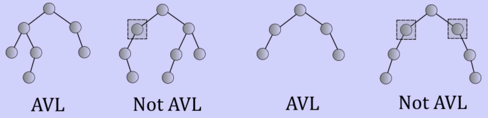
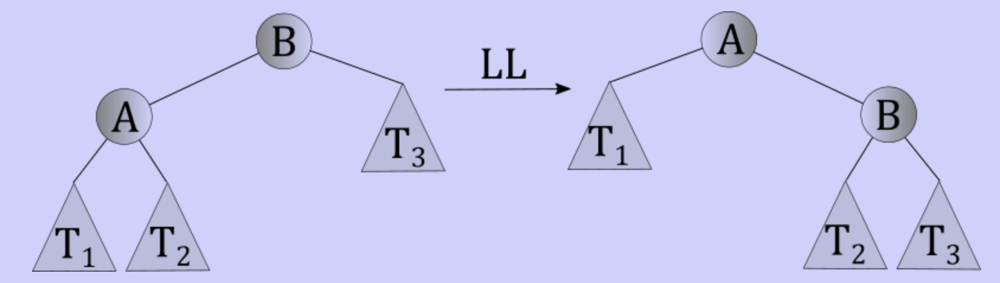
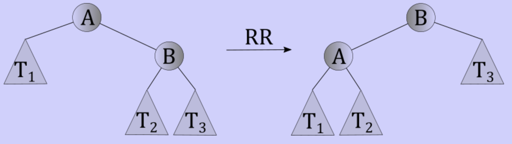
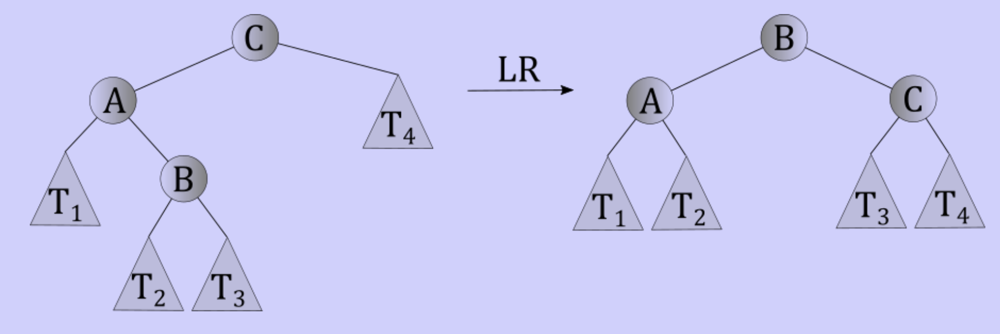
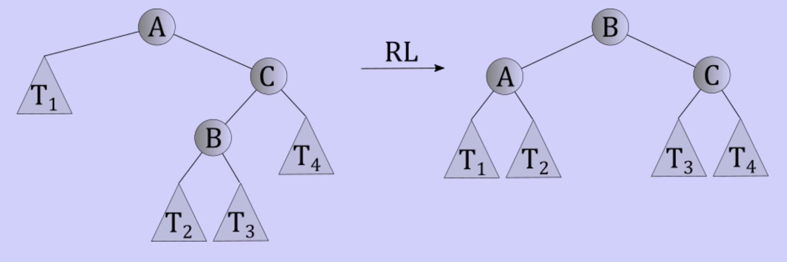

# AVL trees

## Binary tree extremes

### Perfect

- Lookups, insertions, and removals take logarithmic time

### Degenerate

- Lookups, insertions, and removals take linear time

### How likely?

- Degenerate trees emerge naturally
	- Start with an empty tree
	- Insert 1
	- Insert 2
	- Insert 3
	- ...
	- Tree is degenerate
- Fairly common to add data in order

## Aiming for perfect trees

### Perfect binary tree

- Every level with a node has every possible node
- Exists for 1, 3, 7, 15
- Do exists for other node counts
- Not viable to always be perfect

### Complete binary tree

- Has every level filled except for the bottom level
- Bottom level nodes should be to the left

### Cost of keeping a tree complete

- Starting with a complete tree with 6 nodes
- Adding a node makes a perfect tree
- Requires all keys to move to maintain ordering principle
- At least linear time moving nodes around (at best)
- Too expensive to maintain

### Tolerate a balance conditions

- Looks more like perfect, less like a degenerate tree
- Good balance conditions
	- Height of a binary search tree that meets the condition is logarithmic
	- It takes at most logarithmic time to rebalance after insertion or removals

## The AVL tree

- A kind of binary search tree that is almost balanced
- A node in a binary search tree has the AVL property if
	- The weights of its left and right subtrees differ by no more than 1
		- 3 node perfect tree has height 1
		- 1 node tree has height 0
		- empty tree has height -1
- An AVL tree is a binary search tree in which all nodes have the AVL property
- To determine if a binary search tree is an AVL tree
	- Determine the height of left and right subtrees
	- Compare the heights
	- Should differ by no more than 1. If at least 1 violation, the tree is not AVL

### Fixing imbalances

#### Rotations

- Performing rotations is a matter of adjusting a *constant* number of pointers.
- Rotations run in $\theta(1)$

##### LL rotation

- All keys in $T_{1}$ are smaller than $A$
- All keys in $T_{2}$ are larger then $A$ and smaller than $B$
- All keys in $T_{3}$ are larger than $B$

- $B$'s parent would now point to $A$ where it used to point to $B$
- $A$'s right child would now be $B$ instead of the root of $T_{2}$
- $B$'s left child would now be the root of $T_{2}$ instead of $A$

##### RR rotations

- Similar to LL rotations, it is actually the mirror of the aforementioned rotations

##### LR rotations

- A few extra pointers need to manipulated in this rotation, but it is still constant

##### RL rotations

- Finally, this mirror of the previous rotation

#### Insertions

- Start with an AVL tree
- Regular BST insertion
- Fix imbalance if needed
- If imbalance found
	- Take two steps toward insert
	- Order of steps indicate which rotation to use
- After insertion, one rotation will be enough to fix any imbalance
- At most logarithmic time to correct imbalance

#### Removal

- Start with AVL tree
	- Regular BST removal
	- Fix all imbalances
- After removal, might need a rotation at every level
- At most logarithmic time to correct imbalance
- Works based on the fact that the height of an AVL tree is logarithmic on the number nodes