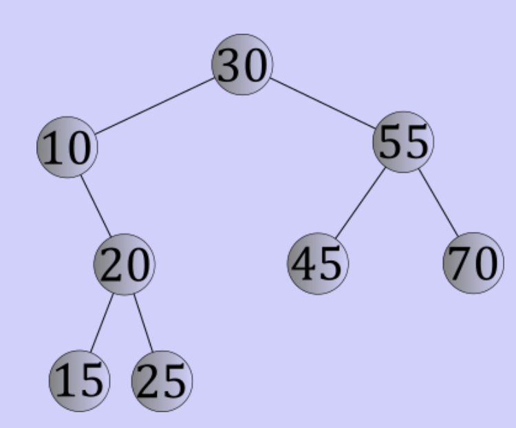
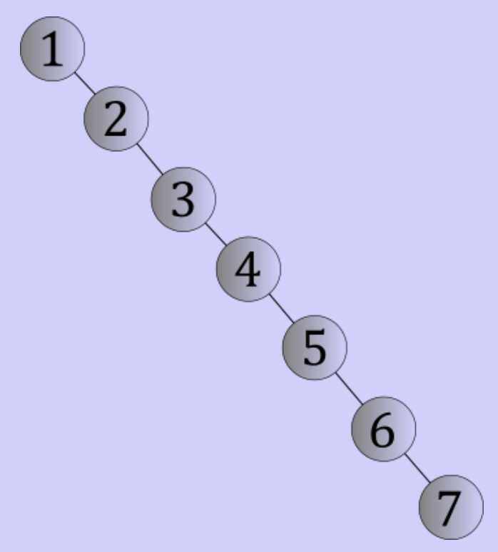
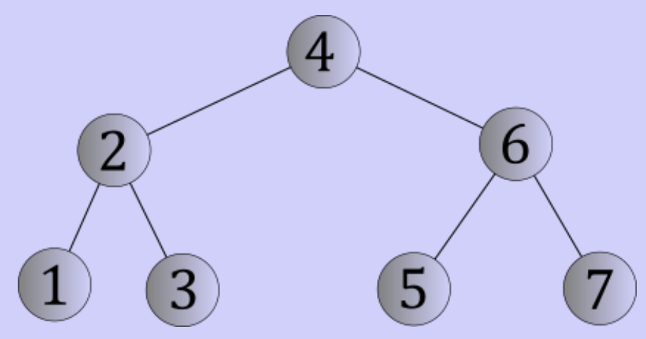

# Binary search trees

## The binary search algorithm

- Sorted array can be searched more quickly
- Typically faster than a linear search

## Binary search tree



- Is a binary tree
- Two subtrees
	- One to the left
	- One to the right
- Every internal node
	- Stores a unique key (orderable)
	- For every node n with key k
		- All nodes in n's left subtree have keys that are less than k
		- All nodes in n's right subtree have keys that are greater than k
- Purpose
	- Searching
	- Compare to current node
		- Go to left child if key < current node
		- Go to right child if key > current node
	- Continue until
		- Key found
		- Find empty subtree

## Lookups

- Worst case: follow the longest path of the tree (height)
- Runtime: $O(h)$ where $h$ is the height of the tree

### Extreme trees

- Degenerate trees
	- Empty subtree on one side
	- Subtree on other side
	- Shaped like a liked list
	- Lookup time is $O(n)$



- Perfect binary trees
	- As good as it gets
	- Every level with any nodes on it has every node on it (every level is full)
	- Has $2^{k}$ nodes on level $k$
	- With height $h$ has $2^{h + 1} - 1$ nodes
		- $n = 2^{h + 1} - 1$
		- $\log_{2}(n + 1) - 1 = h$
		- Has a logarithmic shape
	- Has height $\theta(log_{2}(n))$
	- Lookup time is $O(\log_{2}(n))$



## Traversals

- Depth first and breadth first traversals are valid

### Inorder traversal

- Tree has an ordering property
	- Can it be traversed in order?

```
inorder(Tree t):
	if t is not empty
		inorder(left subtree of t)
		visit(key in root of t)
		inorder(right subtree of t)
```

## Insertions

- Insert at an appropriate leaf node
- Insertion is lookup with a constant amount of work at the end
- Lookup takes $O(h)$ time, therefore insertion also takes $O(h)$ time

## Removals

- Search for node to remove (lookup)

### Removing leaf nodes

- Simply delete the node
- Point parent's child pointer to null

### Removing internal nodes

- If one child
	- Point around to the one child
	- Delete the node
- If two children
	- Find max key in left subtree or min key in right subtree
	- That key is as close to key to remove as possible
	- Swap the keys
	- Remove the node containing the key to remove
	- Max/min will be guaranteed to not have 2 children

### Analysis

- One lookup for key to remove
- Another lookup for the replacement key
- Lookups bounded by height of the tree
- For degenerate trees: $O(n)$
- For perfect trees: $O(\log_{2}(n))$