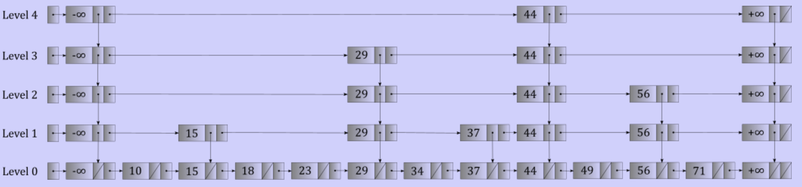

# Skip lists

## Tolerating imperfection

- Aim for a perfect binary tree?
	- Do not exist for every number of nodes
- Complete binary tree?
	- Too expensive to maintain

## The skip list

- Essentially of linked list
- Every level is a subset of those level below it
- Upper levels act as "express lanes"
- Bounded by positive and negative infinity



### Searching

```
start at the head node of the top level

loop:
	if the current node's key is the one we're looking for:
		found it!
	else if the next node's key is larger than the key we're looking for:
		move down one level (terminate the search if we're already at the bottommost level)
	else:
		move forward to the next node of this level
```

### Inserting

- Begin by doing a search, keys are required to be unique
- Find the appropriate insertion point in level 0
- Place on level 0, then repeat
	- Flip a "coin"
	- If the coin is 1, insert the key on the next level up and repeat
	- If the coin is 0, we're done

### Removing

- Search for the node
- If not found bail
- If found, remove nodes found from each level

### Analysis

- Memory usage
	- Level 0 has $n$ nodes
	- Level 1 has around $n/2$ nodes
	- level 2 has around $n/4$ nodes
	- Follows a geometric series
	- Total number of nodes is around $2n$
- Height of a skip lists
	- Depends on the coin flipped
	- Probability of an individual key being on level $i$ is $1/2^{i}$
	- Probability of any of the $n$ keys being of level $i$ is less than or equal to $n/2^{i}$
	- Unlikely worse than logarithmic height
	- Expected height is $\theta(\log_{2}(n))$
- Search time
	- Traverse down $\theta(\log_{2}(n))$ levels
	- On average, we'll see two nodes per level or about $2\log_{2}(n)$ nodes
	- Searching takes at most $\log(n)$ time is expected