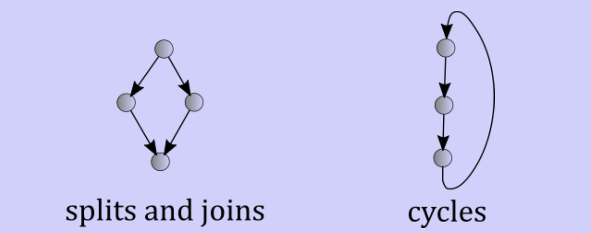
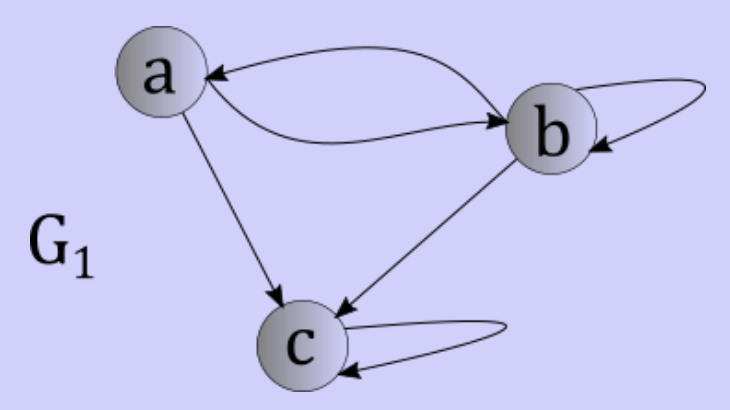
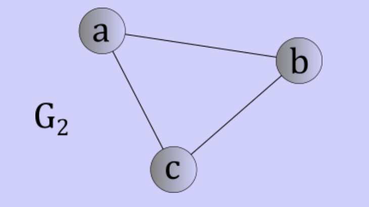

# Graphs

## Using trees

- The data is inherently hierarchical
- Data can be laid out in a pattern to solve a problem
	- Binary trees
	- Min/Max heaps

### Where they fall short

- Splits and joins: nodes are not disjoint subtrees
- Cycles: lower nodes cannot lead to higher nodes



## Graph types

### Directed graphs

> A directed graph (digraph) consists of two things
> 	- A finite set $V$ of vertices
> 	- A finite set $E$ of ordered pairs of vertices, each called an edge

$$
	V = \{ A,\, B,\, C\}
$$

$$
	E = \{ (A,\, B),\, (A,\, C),\, (B,\, A),\, (B,\, B),\, (B,\, C),\, (C,\, C)\}
$$



- First member of an ordered pair has a direct path to the second member
- Nodes can have paths that lead to themselves
- We say that $v \to w$ if an edge exists starting at $v$ and leading to $w$
	- This edge is an outgoing edge of $v$
	- This edge is an incoming edge of $w$
- Out-degree: the number of edges leaving a node
- In-degree: the number of edges leading to a node
- Path: a sequence of vertices starting at a node an ending at another node
	- Length is based on how many edges are followed to get from beginning to end
- Cycle: A path with a positive length that begins and ends with the same vertex

#### Application: C++ compiler

```C++
class A {}
class B: public A {}
class C {}
class D: public C {}
class E: public B public D {}
class F: public E {}
```

- An inheritance relation can represented as a directed graph
- Inheritance relations cannot contain a cycle
- The following relation is illegal

```C++
class X: public Z {}
class Y: public X {}
class Z: public Y {}
```

- By building a direct acyclic graph (DAG), the inheritance relations of a program can be validated

### Undirected graphs

> An undirected graph consists of two things
> 	- A finite set $V$ of vertices
> 	- A finite set $E$ of two element sets of vertices, each called an edge

- The degree of a node simply becomes the number of edges that it appears in



### Describing graphs

- We use 2 variables: 
	- $v$: the number of vertices in the graph
	- $e$: the number of edges in the graph

## Implementing graphs

- Do **NOT** use vertex objects and pointers

### Adjacency matrix

- Utilizes a 1D array for vertex information

| 0 | 1 | 2 |
|:---:|:---:|:---:|
| A | B | C |

- Utilizes a 2D structure with as many rows and columns as the number of vertices for edge information
$$
	\begin{bmatrix}
		0 & 1 & 1 \\
		1 & 1 & 1 \\
		0 & 0 & 1 \\
	\end{bmatrix}
$$

- If $1$, there exists and edge between the vertices
- If $0$ there is no edge
- Does not necessarily need to be boolean, could be a value (like cost to cross an edge)

#### Analysis

- Memory
	- Same amount of memory for each vertex and edge
	- $\theta(v)$ for vertex information
	- $\theta(v^{2})$ for edge information
- Time
	- Check for edge $i \to j$
		- If $i$ and $j$ and known, checking edge information is $\theta(1)$
	- Enumerating all edges
		- Walking every row of edge information: $\theta(v^{2})$
		- Wasteful if graph is sparse: $e << v^{2}$

### Adjacency list

- 1D array  of vertex information
- Attach a vector to each cell in vertex information array

#### Analysis

- Memory
	- Amount for for vertex array is the same for undirected and directed graph
	- Amount for edge lists
		- $e$ for digraphs
		- $2e$ for undirected graphs
	- $\theta(v) + \theta(e) = \theta(v + e)$
- Time
	- Check for edge $i \to j$
		- $O(v)$ correct, but not accurate
		- If $m$ is the max number of outgoing edges, we could say $O(m)$
		- If $d$ to be the out-degree of vertex $i$, we could say $O(d)$
	- Enumerating all edges
		- Simply traverse the vertex list and each edge list: $\theta(v + e)$

### Sparse and dense

- Use adjacency lists if graph is sparse
- Use adjacency matrix if graph is dense