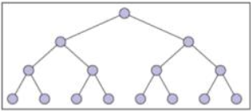
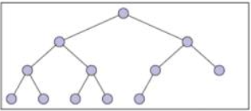

# Structural induction

### Recursively defined structures

- A basis explicitly states that one or more specific elements are in the set
- A recursive rule shows how to construct larger elements in the set from elements already known to be in the set
	- There is ofter more than one recursive rule
- An exclusion statement states that an element is in the set only if it is given in the basis or can be constructed by applying the recursive rules repeatedly to elements given in the basis

### Directories/folders

- Definition
	- Base: an empty folder or a file
	- Recursion: you can expand a folder by putting in a file or **another folder**

> This process must stop somewhere -- at a folder with no other folders inside.
> This is the principle of well-ordering applies: every set of directories must have the least element, which is a folder with no folders inside

### Strings defined recursively

- Definition
	- Base case: $a \in S$
	- Recursive rules: if $x \in S$
		- $xb \in S$
		- $bx \in S$
		- $axa \in S$
		- $xaa \in S$
- Prove: every string in $S$ contains an odd number of a's

> Base case:
> 	'a' contains an odd number (1) of a's
> Inductive step:
> 	case 1:
> 		adds 0 a's -> number of a's stays odd
> 	case 2:
> 		adds 0 a's -> number of a's stays odd
> 	case 3:
> 		adds 2 a's -> $2n + 1 + 2 = 2(n + 1) + 1$ is odd
> 	case 4:
> 		adds 2 a's -> $2n + 1 + 2 = 2(n + 1) + 1$ is odd

### Linked lists

- A linked list is either
	- Base case: `[]` (known as the empty list)
	- Recursive rule: `[x] + L` (where `x` is an arbitrary element and `L` is linked list)

```
+---+---+   +---+---+   +---+---+   +---+---+
| 1 | --+-->| 7 | --+-->| 7 | --+-->| 6 | / |
+---+---+   +---+---+   +---+---+   +---+---+
```

### Binary trees

- If instead of 1 pointer we allow 2, we get binary trees. A binary tree is either
	1) The empty tree, denoted by null
	2) a root node `x` a left subtree `t1` and a right subtree `t2` where `x` is an arbitrary value and `t1` and `t2` are both binary trees
- Each node in a binary tree is either
	1) A **leaf** node where the left and right subtrees are both null
	2) An **internal** node is a *not* a leaf

#### Complete trees



#### Almost complete trees



## Structural induction

- Proceeds over recursive structure itself, rather than just using numbers
- Case case is based on a basis for recursion
- Inductive step is based on a recursive rule
- Recursion and math induction are cousins
- We can use math induction to prove results we get as a result of recursion
- We can also often turn an induction proof into a recursive procedure to solve a problem