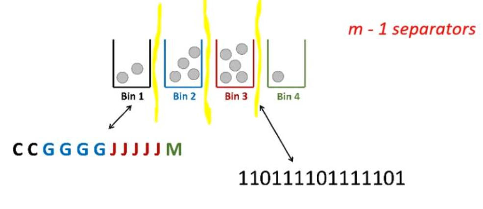

# Balls into bins

## A different representation

- How many ways to throw $n$ identical balls into $m$ distinct bins

### Lower bounds

- How many ways to throw 12 identical balls into 4 distinct bins with *at least* two in each bin
	- Place two balls in each bins
	- Then find how many ways to place 4 identical balls into 4 bins
	- ${4 + 3 \choose 3} = { 7 \choose 3 } = 35$

### Indistinguishable balls

- How many wats are there to put 3 *indistinguishable* balls in 5 distinguishable bins with at most one per bin?
- Can put 3 balls into 5 bins ${ 5 \choose 3 }$ ways 

### Distinguishable balls

- How many ways are there to put 3 *distinguishable* balls into 5 distinguishable bins at most one per bin?
- Can put 3 balls into 5 bins $P(5, 3)$ ways

- How many ways are there to put 3 *distinguishable* balls into 5 distinguishable bins with no limit on the number of balls per bin?
- Can put 3 balls into 5 bins $5^{3}$

