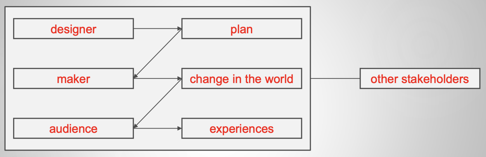
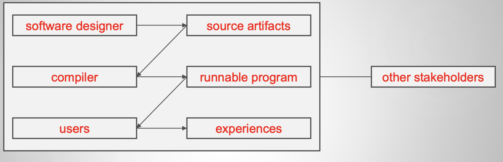

# Lecture 1

## Logistics

### Helpline

> https://edstem.org/us/courses/34333/discussion/

### Grade breakdown

| Group | Weight |
|:------:|:-------:|
| Final project | 32% |
| Assignment 1-1 | 12% |
| Assignment 1-2 | 12% |
| Assignment 2 | 22% |
| Assignment 3 | 22% |
| Course evaluation | 1% Extra credit |

- No exams!!!

## Preview of in4matx 122

### The term "design"

- Design *activity*
- Design *product*
- Design *field*

### Defining design

> Features of shape, configuration, pattern or ornamentation applicable to an article, being features that, in the finished article, can be judged by the eye,  but does not include a method or principle of construction.

> The imaginative jump from present facts to future possibilities

> The optimum solution to the sum of true needs of a particular set of circumstances

> To conceive or plan out in the mind

> A plan or protocol for carrying out or accomplishing something

- Similarities
    - Includes a plan
    - Includes an intention
- More definitions
    1) The realization of an imagined state
    2) To work out a solution in one’s mind
    3) The specification that guides production
    4) The transition from possible solutions to a specific one
    5) To devise a solution to a perceived proble
- According to [Google](https://www.google.com/search?q=what+is+design)

### In4matx 122 design

> To decide upon a plan for a novel change in the world that, when realized, satisfies stakeholders

### Purpose of designs

- Designs *to think*
- Designs *to talk*
- Designs *to prescribe*

> Software designs are developed **iteratively**

## Software design

### Activities

- System-wide activities
    - Architecture
    - Languages
    - Libraries
    - Platforms
- Lower-level decisions in an *iterative* manner
    - Studying the problem
    - Identifying solutions
    - **Creating abstractions**
        - Modularize the task so multiple people can work on it
        - Defining modules and their interfaces
    - Evaluating
- Inputs
    - Domain knowledge
    - Method knowledge
    - Experience from similar projects

> Requirements -> Architecture & **design** -> Code

### Design phases

- Waterfall: once (design is a phase)
- Incremental: multiple (conducted more than once until done)
- Spiral: as needed (conducted continuously with risk assessment)
- Agile: all the time (design is in the code)

> Design is *technically* everywhere

### Feasibility and desirability

- Feasibility: What can we actually do?
    - What is the conceptual core?
    - What are its implementation details?
- Desirability: What we want to do?
    - What is it to accomplish?
    - How does one interact with it?

### Types of software design

- Application design
- Interaction design
- *Architecture design*
- **Implementation design**
- **Maintenance design**

### Focus

- Nuts and bolts (but still some creative thinking)
- Specifying for colleagues (but still relying on colleagues)
- Complete specifications
- Implementations (in Java :( )

### Practice and making meaning

- Design is a practice-driven discipline
- Understand the **theories** behind software design and its limitations
- Understand when to apply those theories, alter them, or come up with new ones
- Understand the **rationale** of your decisions
- Not just input/output or a sequence of steps conducted **mindlessly**

