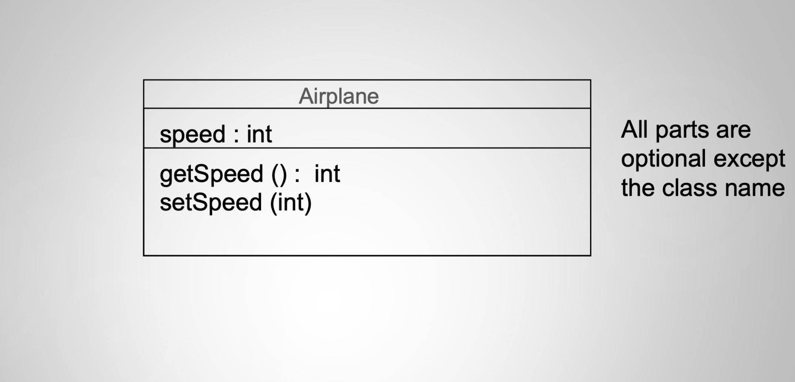
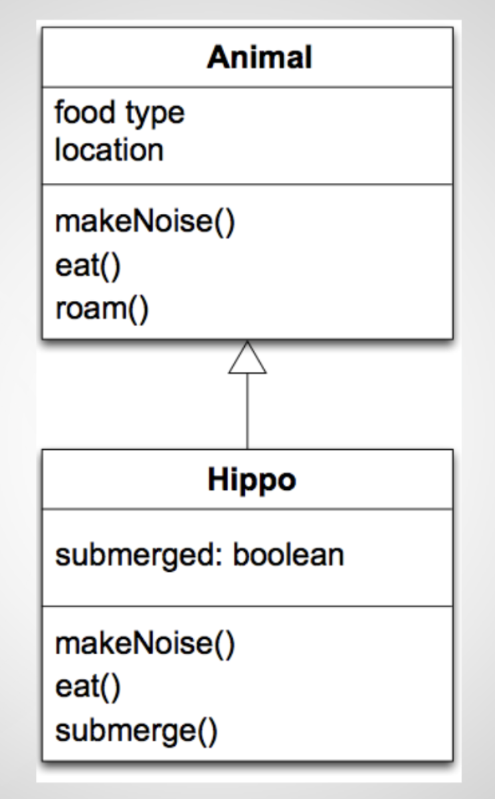
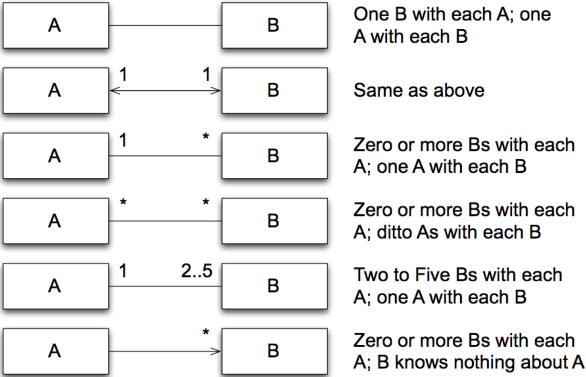
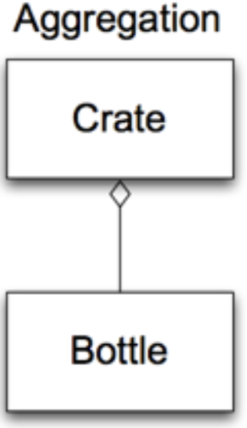
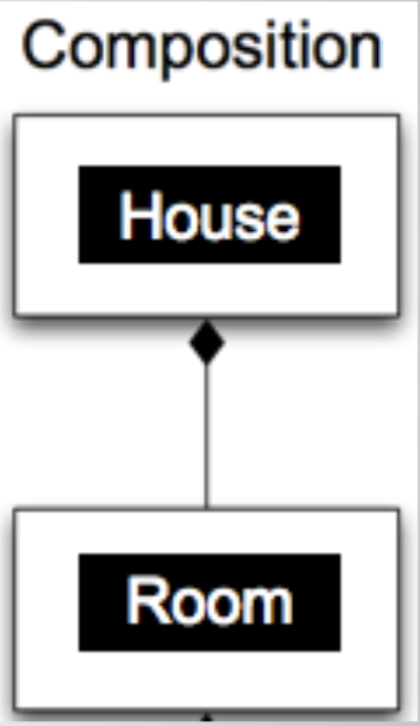
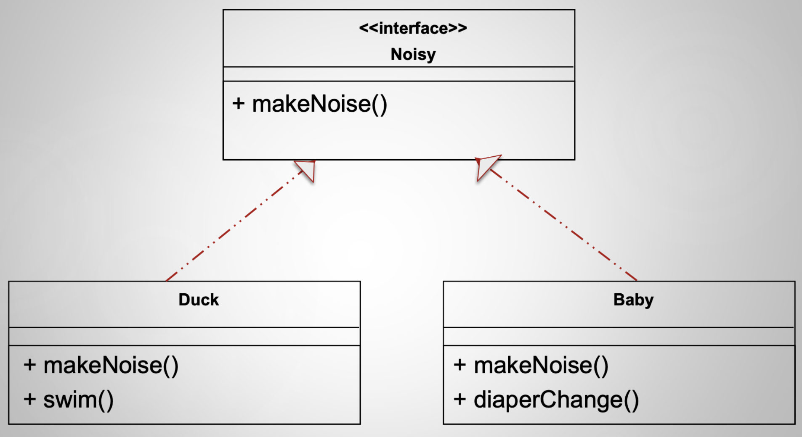

# Lecture 2

## Design aesthetics

### Aesthetics

> a particular theory or conception of beauty or art 
 
> a particular taste for or approach to what is pleasing to the senses and especially sight

### Design aesthetics

- Different people will have a different aesthetic appreciation of different designs
    - Pre-existing knowledge
    - Understanding of the design goals
    - Own ideas
- Different roles in the software development project may have different aesthetic appreciation of different designs
    - Coder
    - Performance engineer
    - Maintenance specialist
    - Tester
- Subjuctive, fuzzy
- Need some kind of shared "language"
    - Understand the underlying implications of certain designs
    - Understand the intentions of designers
    - Effectively frame our communication about designs

### Purpose of implementation design

- An implementation design
    - Is a road map
    - Describes a path from application / interaction / architecture design to the product
    - Describes what the **implementers** to do
    - Is a guide towards **future change**
- Implementation designs should be
    - Understandable, unambiguous, consistent, helpful
    - Correct, complete, consise, verifiable, effective
    - Elegant, partitionable, recomposable, resilient
    - Evolvable

> The goal of this class is to develop your understanding of these qualities!

## UML review

### What is UML?

- UML = unified modeling language
- A set of notations designed for specifying object-oriented systems
    - **Class diagrams**
    - **Sequence diagrams**
    - Use case diagrams
    - Activity diagrams


### Example diagram

#### Diagram



#### Translation to code

- Class diagrams can be translated into code straightforwardly
    - Define the class with the specified name
    - Define the specified attributes
    - Define the specified method skeletons
- May have to deal with unspecified information
    - Types of optional is class diagrams
    - Typically do not specify constructors

#### Airplane in Java

```Java
public class Airplane {

    private int speed;

    public Airplane(int speed) {
        this.speed = speed;
    }

    public int getSpeed() {
        return speed;
    }

    public void setSpeed(int speed) {
        this.speed = speed;
    }
}
```

```Java
Airplane a = new Airplane(5);
a.setSpeed(10);
System.out.println("" + a.getSpeed())
```

### Relationships between classes

#### Inheritance



#### Association


- Roles and labels can be specified along the line connecting the classes

#### Multiplicities

- Indicates how many instances of a class participate in an association
- An association can also indicate directionality



#### Aggregation

- One object contains a set of other objects
- These relationships are **transitive and assymetric**



#### Composition

- A variant of aggregation which adds the property of **existence dependency**



#### Interfaces

- A type of class definition in which only method signatures are defined
- A class implementing an interfaces provides method bodies for each method defined in the interface



## Approaches to date

### Enumerate objectives

- Overall process
    - Apply rigor (thorough, exhaustive, accurate)
    - Separate concerns (modularize, abstract)
    - Anticipate change
    - Generalize
    - Work incrementally
- Overall design
    - Group related functionalities (high cohesion)
    - Ungroup semi-related functionalities (high cohesion)
    - Reduce interdependency (low coupling)
- Individual class design
    - Cohesion
    - Completeness
    - Convenience
    - Clarity
    - Consistency

### Define principles

- Information hiding
    - Hide design decisions that are most likely to change
- Acyclic dependencies
    - Structure packages such that dependencies form a directed acyclic graph
- SOLID
    - **S**ingle responsibility
        - Too many responsibilities can cause problems
        - KISS: keep it simple stupid
    - **O**pen-closed
        - Should be open for extensions
        - Closed for modifications
        - Extenstion > modification
    - **L**iskov substitution
        - Subtypes must be substitutable for their base types
        - A subclass should not break the expectations set by its superclass
    - **I**nterface segregation
        - Many client-specific interfaces are better than one general purpose interface
    - **D**ependency inversion
        - Depend on abstractions, not "concretions"
        - Code should depend on things that are at the same or higher level of abstraction
        - Abstractions should not depend on details
        - High-level modules should not depend on low-level modules
        - Details should depend on abstractions

### Provide strategies

- Program to the interface
    - Program to the interface, not to an implementation
    - Wrap classes in interfaces as much as possible
- Refactor
    - (come back in future)
- Apply software patterns
    - (come back in future)


