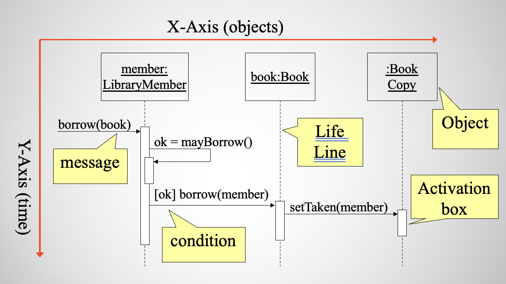

# Lecture 3

## Sequence diagrams

### What are they?

- A type of interaction diagram
- Interaction diagrams describe interactions between model elements
- Can be applied to
    - A single use
    - A scenario
- Verify that a use case description can be supported by the existing classes
- Assist in understanding how a use case works
- Illustrates how objects interact with each other
- Emphasize time ordering of messages
- Can model
    - Simple flow
    - Branching
    - Iteration
    - Recursion
    - Concurrecy

### Interpreting

### Objects

- Name
    - Syntax: `[instanceName][:className]`
    - Name should be consistent with class diagram
    - Include when objects are referred to in messages or multiple exist

### Messages

- An interaction between two objects
- Associationg links must exist in order for messages to be passed
- Exchanges should reflect links in class diagram
- Represented by a solid arrow 
    - Self calls are allowed
    - Time required to process message is represented by an activation box
- Label with a message name
    - May include arguments and control information

### Return values

- Represented with a dashed arrow
- Avoid using if obvious
- Use if message response needed elsewhere
- Prefer modeling as part of a method invocation

### Synchronous messages

- Nested flow of control, usually represented as an operation call
- Routine that handles the messages is completed before caller resumes execution

### Object management

- An object may create another object with a `<<create>>` message
- An object may destroy another object with a `<<destroy>>` message
    - Objects may destroy themselves
    - Avoid modeling unless memory management is critical

### Control information

- Condition
    - syntax: `['expression'] message-label`
    - Message sent only if the condition is true
- Iteration
    - syntax `*[ 'expression' ] message-label`
    - Message is sent multiple times to possibly multiple receivers
- Intended to model simple alternatives
    - Split up diagram if too complicated
    - Do not provide detailed modeling of algorithms