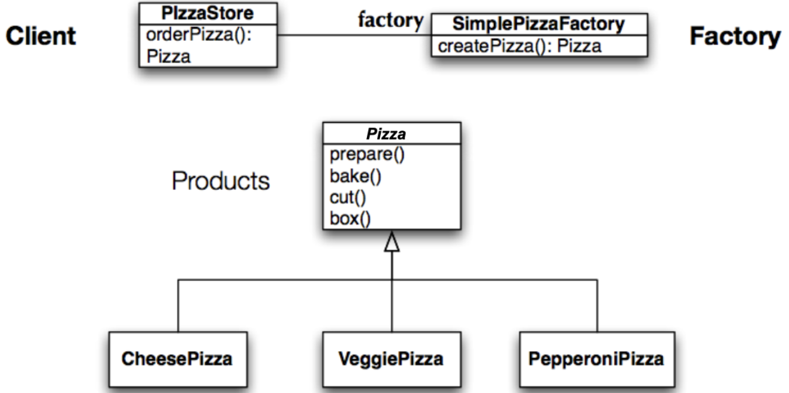
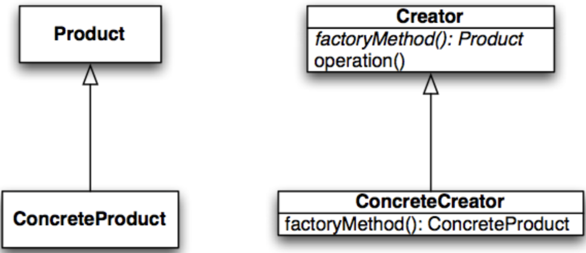
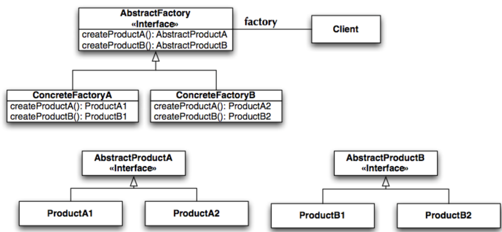

# Lecture 6

## Making objects

### The problem with `new`

- Each time it is used, it **breaks encapsulation**
- Even if the variable uses an interface, code still depends on class
- If code instantiates a particular subtype based on the state of the program, then code depends on each concrete class

### The pizza store examples

```Java
public class PizzaStore {
    Pizza orderPizza(String type) {
        
        Pizza pizza;

        if (type.equals("cheese")) {
            pizza = new CheesePizza();
        } else if (type.equals("greek")) {
            pizza = new GreekPizza();
        } else if (type.equals("pepperoni")) {
            pizza = new PepperoniPizza();
        }

        pizza.prepare();
        pizza.bake();
        pizza.cut();
        pizza.box();

        return pizza
    }
}
```

### Encapsulating creation code

- Could put creation code in a separate class
- Solves direct dependency
- Not as flexible as it can be



## Factory method

### Definition

- The Factory Method design pattern defines an interface for creating  an object, but lets subclasses decide which class to instantiate.  
- Factory Method lets a class defer instantiation to subclasses.
- Factory Method leads to the creation of parallel class hierarchies
- `ConcreteCreators` produce instances of `ConcreteProducts` that are operated on by `Creators` via the `Product` interface

### Structure



### Helps with

- Placing abstract code in a superclass
- Placing object creation code in a subclass
- Framework invokes factory method to create objects
- Clients of the framework subclass the superclass and provide an implementation of the factory method
- Dependencies on concrete "products" are encapsulated in the subclass

### Struggles with

- The abstract code forces following of procedures
- To strict too allow concrete class intracasies

## Abstract factory

### Definition

- The Abstract Factory design pattern provides an interface for creating families of related or dependent objects without specifying their concrete classes

### Structure



### Characteristics

- Isolates concrete classes
- Makes exchanging product families easy
- Promotes consistency among products

## Factory method vs. Abstract factory methods

### Similarities

- Achieve loose coupling
- Reduce dependency of application on concrete classes
- Relation to the dependency inversion principle
    - Code to abstraction, not concrete classes

### Differences

| Point | Factory method | Abstract factory method |
| ----- | -------------- | ----------------------- |
| OO relationship for object creation | Inheritance | Object composition |
| Product cardinality | Single product | Family of products |
| Use considerations | Don't know ahead of time all the concrete classes you need | To make sure clients create products that belong together
| When new products are added | Only single product, so no interface changes | Interface changes |

