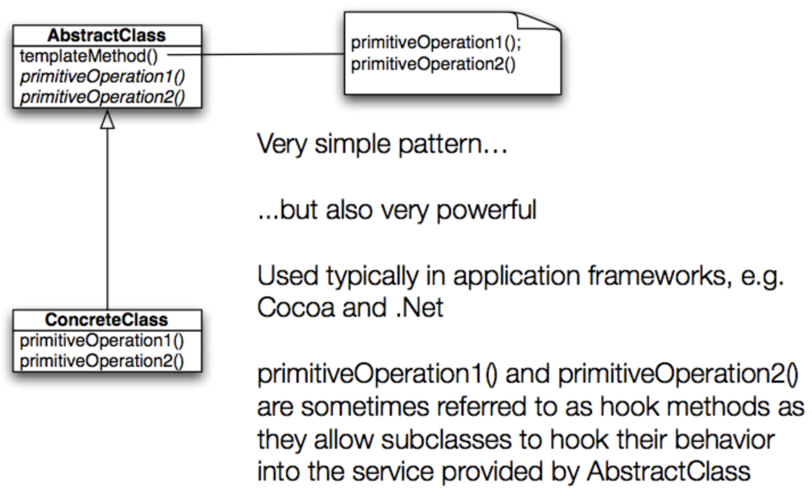

# Lecture 7

## Template method

### Defintion

- The Template Method pattern defines the skeleton of an algorithm in a method, deferring some steps to subclasses.  
- Template Method lets subclasses redefine certain steps of an algorithm without changing the algorithm’s structure
- Template Method defines the steps of an algorithm and allows subclasses to provide the implementation for one or more step

### Benifits

- Makes the algorithm abstract
    - Each step of the algorithm is represented by a method
- Encapsulates details of most steps
    - Steps (methods) handled by subclasses are declared abstract
    - Shared steps (concrete methods) are placed in the same class that has the template method
        - Allows for code re-use among various subclasses

### Structure



### Template method example

- Consider the following recipes

|Step | Coffee | Tea |
|:---:| --- | --- |
| 1 | Boil water | Boil water |
| 2 | Brew coffee in boiling water | Steep tea in boiling water |
| 3 | Pour coffee into cup | Pour tea into cup |
| 4 | Add sugar and milk | Add lemon |

#### Coffe implementation

```Java
public class Coffee {

    void prepareCoffee() {
        boilWater();
        brewCoffeeGrinds();
        pourInCup();
        addSugarAndMilk();
    }

    public void boilWater() {
        System.out.println("Boiling water");
    }

    public void brewCoffeeGrinds() {
        System.out.println("Dripping coffee through filter");
    }

    public void pourInCup() {
        System.out.println("Pouring into cup");
    }

    public void addSugarAndMilk() {
        System.out.println("Adding sugar and milk");
    }
}
```

#### Tea implementation

```Java
public class Tea {

    void prepareCoffee() {
        boilWater();
        steepTeaBag();
        pourInCup();
        addLemon();
    }

    public void boilWater() {
        System.out.println("Boiling water");
    }

    public void steepTeaBag() {
        System.out.println("Steeping the tea");
    }

    public void pourInCup() {
        System.out.println("Pouring into cup");
    }

    public void addLemon() {
        System.out.println("Adding lemon");
    }
}
```

### Problem: code duplication

- The `boilWater` and `pourInCup` method are the exact same in both classes
- Can get rid of the duplication by putting these identical methods into a parent class

### Similar algorithms

- The structure of the algorithms in `prepareRecipe()` is similar for `Tea` and `Coffee`
    - We can improve our code further by making the code in `prepareRecipe()` more abstract
    - `brewCoffeeGrinds` and `steepTea` -> `brew`
    - `addSugarAndMilk` and `addLemon` -> `addCondiments`
- Now all we need to do is specify this structure in `CaffeineBeverage.prepareRecipe()` and make sure we do it in such a way so that subclasses can’t change the  structure  
    - By using the word `final`

#### Caffeine beverage implementation

```Java
public abstract class CaffeineBeverage {
    final void prepareRecipe() {
        boilWater();
        brew();
        pourInCup();
        addCondiments();
    }

    abstract void brew();

    abstract void addCondiments();

    void boilWater() {
        System.out.println("Boiling water");
    }

    void pourInCup() {
        System.out.println("Pouring into cup")
    }
}
```

#### Coffee and tea implementations

```Java
public class Coffee extends CaffeineBeverage {
    public void brew() {
        System.out.println("Dripping coffee through filter");
    }
    public void addCondiments() {
        System.out.println("Adding sugar and milk");
    }
}

public class Tea extends CaffeineBeverage {
    public void brew() {
        System.out.println("Steeping the tea");
    }
    public void addCondiments() {
        System.out.println("Adding lemon");
    }
}
```

### What this accomplishes

- Took two separate classes with separate, but similar, algorithms
- Noticed duplication and eliminated it by adding a superclass
- Made steps of algorithm more abstract and specified its structure in the superclass
- Revised subclasses to implement the abstract (unspecified) portions of the algorithm (in a way that makes sense for them)

## Façade

### Definition

- Provide a unified interface to a set of interfaces in a subsystem. Façade defines a higher-level interface that makes the subsystem easier to use
- There can be significant benefit in wrapping a complex subsystem with a simplified interface
- Façade works best when you are accessing a subset of the system’s functionality
- Façade not only reduces the number of methods you are dealing with but also the number of classes

### Structure


### Example without a façade

- `Client` contacts the `Database` to retrieve `Company` objects. 
- It then retrieves `Division` objects from them and  
- Finally gains access to `Employee` objects.
- It uses **4** classes


### Example with a façade

- `Client` is shielded from most of the classes.
- `Database` Façade to retrieve `Employee` objects directly.


### Façade vs adapter

- Both act as wrappers of existing classes
- Both take an interface we don't want and convert it to an interface that we can use
- With Façade, the intent is to simplify the existing interface
- With Adapter, we have a target interface that we are converting to
- Façade - a single control panel to run all the internal components.
- Adapter - making a square peg fit into a round hole.

## Singleton

### Definition

- Used to ensure that only one instance of a particular class ever gets created and that there is just one (global) way to gain access to that instance

### Derivation

```Java
public class Ball {
    private String color;

    public Ball (String color) {
        this.color = color;
    }
}
```

#### Problem: universal instatiation

- As long as a client object "knows about" the name of class `Ball`, it can create instances of `Ball`
- This is because the constructor is public
- We can stop unauthorized creation of `Ball` instances by making the constructor private

```Java
public class Ball {  
    private String color;  

    private Ball(String color) {  
        this.color = color; 
    }
}
```

#### Problem: no point of access

- Now that the constructor is private, no class can gain access to instances of `Ball`
- We need a method to return an instance of `Ball`
- But since there is no way to get access to an instance of `Ball`, the method **CANNOT** be an *instance method*
- This means it needs to be a class method, aka a static method

```Java
public class Ball {  
    private String color;  

    private Ball (String color) {  
        this.color = color; 
    }

    public static Ball getInstance(String color) {  
        return new Ball (color);  
    }
}
```

#### Problem: back to universal instatiation

- We are back to this problem where any client can create an instance of `Ball`
- Need to ensure only one instance is ever created
- Need a static variable to store that instance

```Java
public class Ball {
    private static Ball ball;
    private String color;  

    private Ball (String color) {  
        this.color = color; 
    }

    public static Ball getInstance(String color) {  
        return ball;  
    }
}
```

#### Problem: no instance

- Now the `getInstance()` method returns `null` each time it is called
- Need to check the static variable to see if it is `null` and if so, create an instance
- Otherwise return the single instance

```Java
public class Ball {
    private static Ball ball;
    private String color;  

    private Ball (String color) {  
        this.color = color; 
    }

    public static Ball getInstance(String color) { 
        if (ball == null) {
            ball = new Ball(color);
        } 
        return ball;  
    }
}
```

#### Problem: first parameter wins

- The code on the previous slide shows the Singleton pattern  
    - private constructor 
    - private static variable to store the single instance  
    - public static method to gain access to that instance  
    - this method creates object if needed; returns it  
    - ensures that only one instance of `Ball` is ever created
- But what if you want only one instance of each color?
    - This code ignores the fact that a parameter is being passed in
    - so if a "red" ball is created all subsequent requests for a "green" ball are ignored

#### Solution: use a map

- The solution to the final problem is to change the private static instance variable to a Map
- Then check if the map contains an instance for a given value of the parameter
    - This ensures that only one ball of a given color is ever created
    - This is a very acceptable variation of the Singleton pattern

```Java
public class Ball {
    private static Map<String, Ball> = new Map<String, Ball>();
    private static Ball ball;
    private String color;  

    private Ball (String color) {  
        this.color = color; 
    }

    public static Ball getInstance(String color) {  
        if (!ballRecord.containsKey(color)) {  
            ballRecord.put(color, new Ball(color));  
        }  
        return ballRecord.get(color);  
    }
}
```

### Singleton structure


- Singleton involves only a single class (not typically called Singleton). 
    - That class is a full-fledged class with other attributes and methods (not shown).
- The class has a static variable that points at a single instance of the class.
    - The class has a private constructor (to prevent other code from instantiating the class) 
    - A static method that provides access to the single instance.