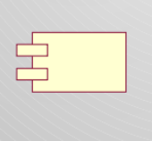

# Lecture 9

## Package and component diagrams

### Stereotypes

- Used to extend UML to create new model elements that can be used in specific domains
- Should always be applied in a consistend matter
- Representing a stereotype
    - Place name of stereotype above name of existing UML element
    - Name should be between `<<` and `>>`

### Package diagrams

- Can group classes to organize complex class diagrams
- A package is a collection of logically related UML elements

### Components

- A component is a named physical and replaceable part of a system
- A component type represents a piece of software code
- A component instance represents a run-time code unit

| Components as container | Components as stereotypes |
| ----------------------- | ------------------------- |
| Source | Executable |
| Binary | Application |
| Executable | File |
| Configuration | Library |
| Makefile | Document |
| IDL bindings | Page |
| Agregation of other component | Technology specific (i.e. JavaBean) |

### Modeling elements with components

- Basic
    - Class
    - Object
    - Interface
    - Active class
    - Node
- Composite
    - Package
    - Component

### Component diagrams

- Graph of components connected by dependency relationships
- Shows the dependencies among software component
    - Dependencies are shown as dashed arrows
    - Dependencies are implementation language specifice

### Component characteristics

- Components trace to the model elements they implement (hence all the way back to use cases)  
- A Component usually implements several elements  
- Components provide the same interface as the model elements they implement  
- Compilation dependencies denote which elements are required to compile a specific component

### UML 1 vs. UML 2

- UML 2 components are modeled as simple rectangles  
    - Uses this symbol as a visual stereotype within the rectangle  
- UML 1.x there were depicted as rectangles with two smaller rectangles jutting out from the left-hand side.  
- Both diagrams model dependencies, either between components or between components and interfaces.  
    - Both diagrams use the lollipop symbol to indicate an implemented interface  
    - The UML 2 version introduces the socket symbol to indicate a required interface.

## Design recovery

### What is it?

- We want to understand  
    - What  
    - How  
    - Why  
- We might need  
    - Formal specifications  
    - Dataflows  
    - Underlying patterns  
    - Informal knowledge  
- More than just re-creating...

### Why recover a design?

- Working with others' code...  
    - Debugging  
    - Maintenance  
    - Reuse  
- Working with your own code  
- You *will* work with code in the absence of a complete design
- No design  
    - Lost design  
    - Build-and-fixed  
    - Agile methodologies  
- Design drift  
    - Common!  
    - Incomprehensible design

### Goals of design recovery

- Recover lost information  
- Cope with complexity  
- Generate alternate views  
- Detect side effects  
- Facilitate Reuse

### Object orientation

- Something of an advantage  
    - Class names, function names  
    - Established relationships (inheritance, members, etc.)  
- High cohesion helps  
    - A holistic sense of purpose

### Finding the structure

- Entities
    - Components
    - Packages
    - Classes
    - Methods
    - Variables
- Relationships
    - Inheritance
    - Member objects
    - Method calls

### Tools/reading/talking

- Reverse engineering (see next section)
- Running the program
- IDE *References* and *Declarations*
- Reading documentation
- Reading class names
- Talking to people
- **Code reading**

## Reverse engineering

- Recreating design abstractions from:  
    - Code  
    - Existing design documentation (if available)  
    - Personal experience  
    - Domain knowledge  
    - Talking to people