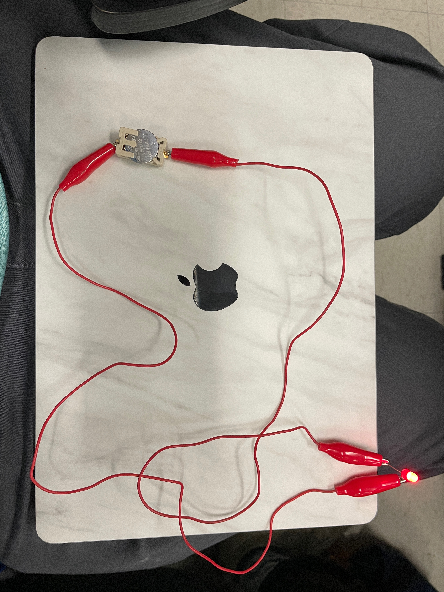
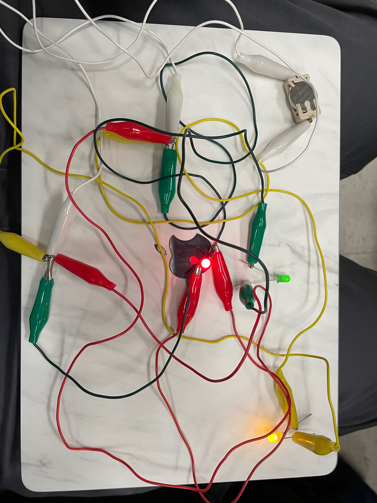

# Lecture 3

## Human centered design

### What is it?

- Designing with user/stakeholders in mind
- Should get users/stakeholders to use/test during design process

### Ideation

- There are no bad ideas
- Stay focused
- Don't spend a lot of time on one idea
- Use the whole room
- No multitasking

## Introduction to circuits

### Simple circuit

Create a simple circuit with 1 LED, battery pack, and alligator clips. Take a photo of what you created with the light turned on and upload it to Canvas.

### Parallel circuit

Light multiple LEDs with one battery pack and as many alligator clips as needed. Take a photo of what you created with all of the LEDs turned on and upload it to Canvas.

