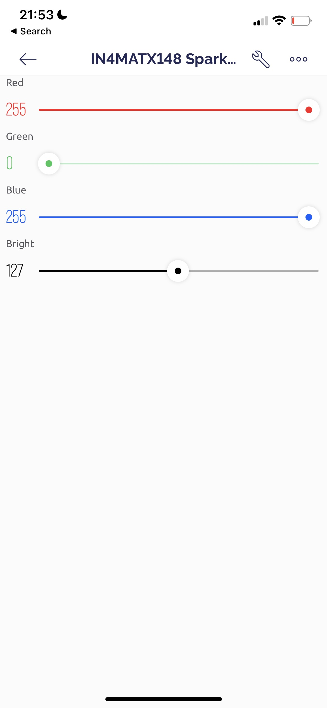
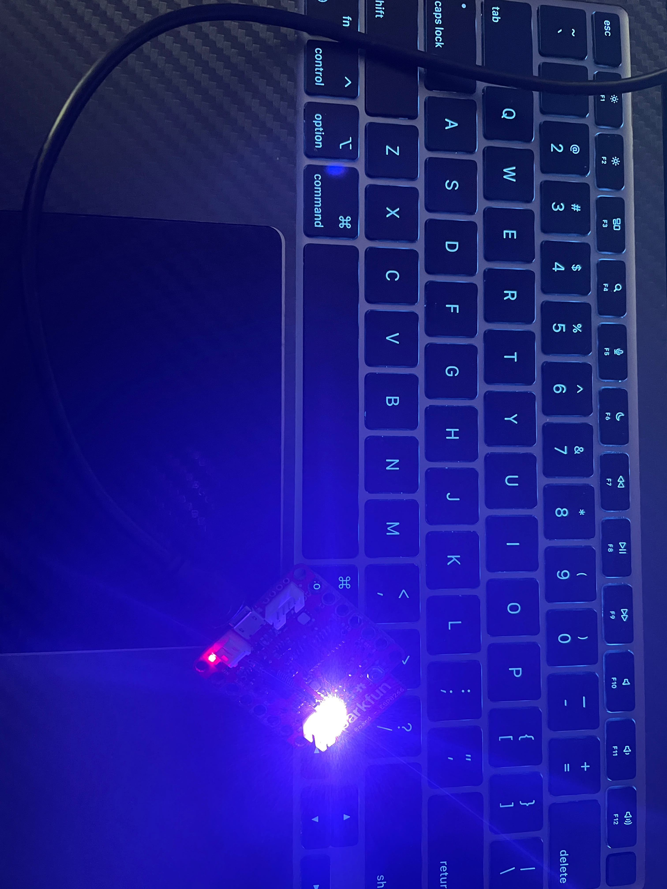
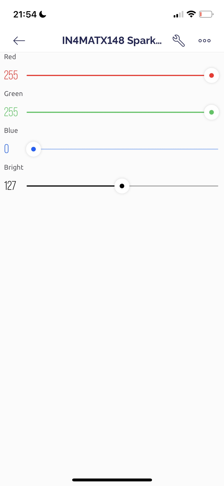
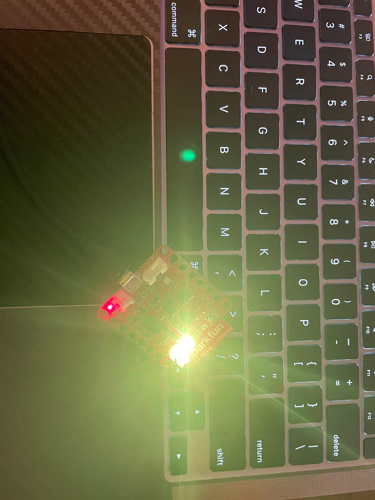

# Lecture 7

## Potentiometers

- Like dimmer switches in home
- Can act as a volume knob
- They are variable resistors

### Potentiometers in appliances

- Audio faders
- Color and brightness controls
- Motion controls

## Color mixing

### Pigment

- White: the absence of color
- Black: the presence of all color
- Everything else: a mixture of colors

### Light

- White: the presence of all light
- Black: the absence of light
- Everything else: a mixture of lights

## Analog vs digital signals

### Analog

- Continuous stream of data
- Looks like a sine wave

### Digital

- A discrete stream of data
- Looks like a square wave

### ADC

- Analog-to-digital converter
- Allows for analog data to be interpreted as a digital signal

## RBG precision control

### Magenta

### Yellow

