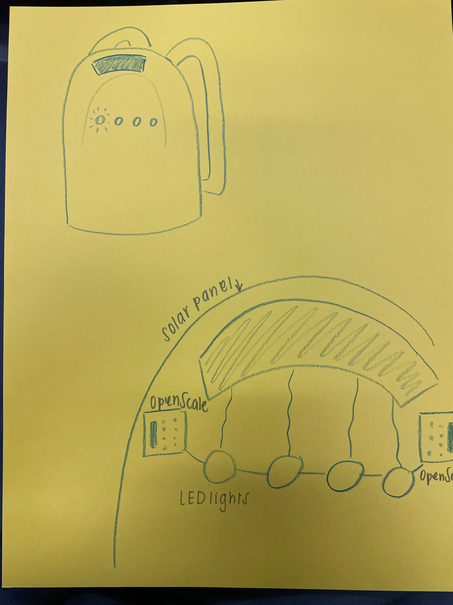
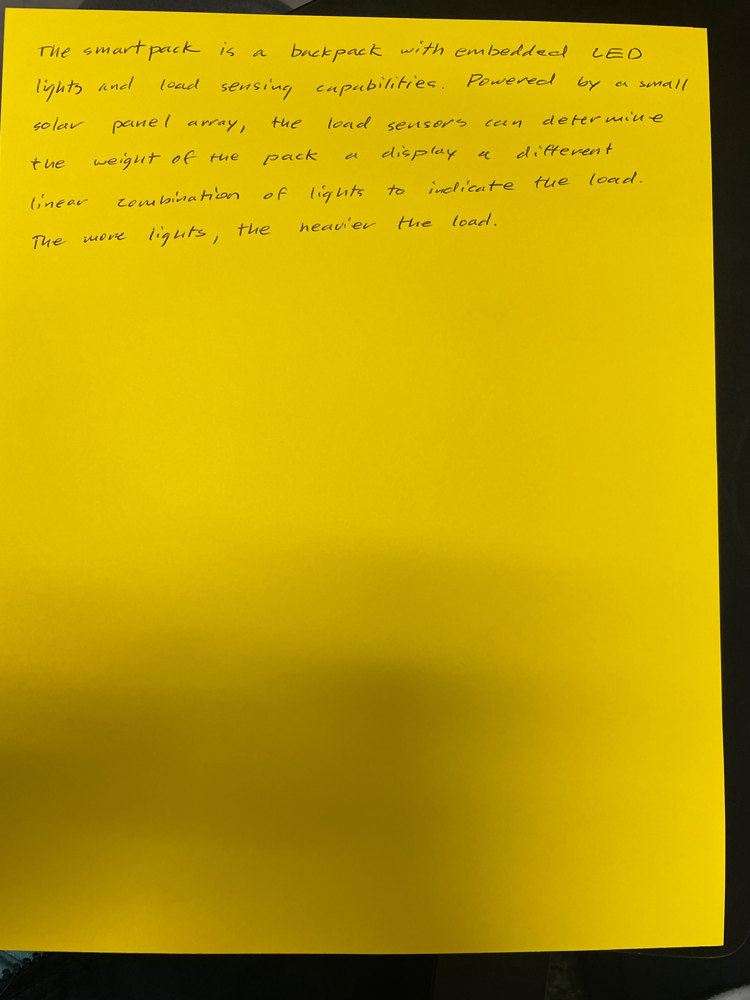

# Lecture 12

## Wearable design

## Final project

### Design ahead

- Research online and pick hardware components
- Include diagrams with project description
- Hand-drawn not acceptable

### Trigger the internet

- Blynk HTTP API
- Blynk webhook
- Allow an event from the internet to trigger a response event on your Blynk board
- Allow an event from your Blyink board to trigger a response event on the internet

### Programming guru

- Use Arduino IDE to reprogram your board
- Can be anything, but board must access the internet