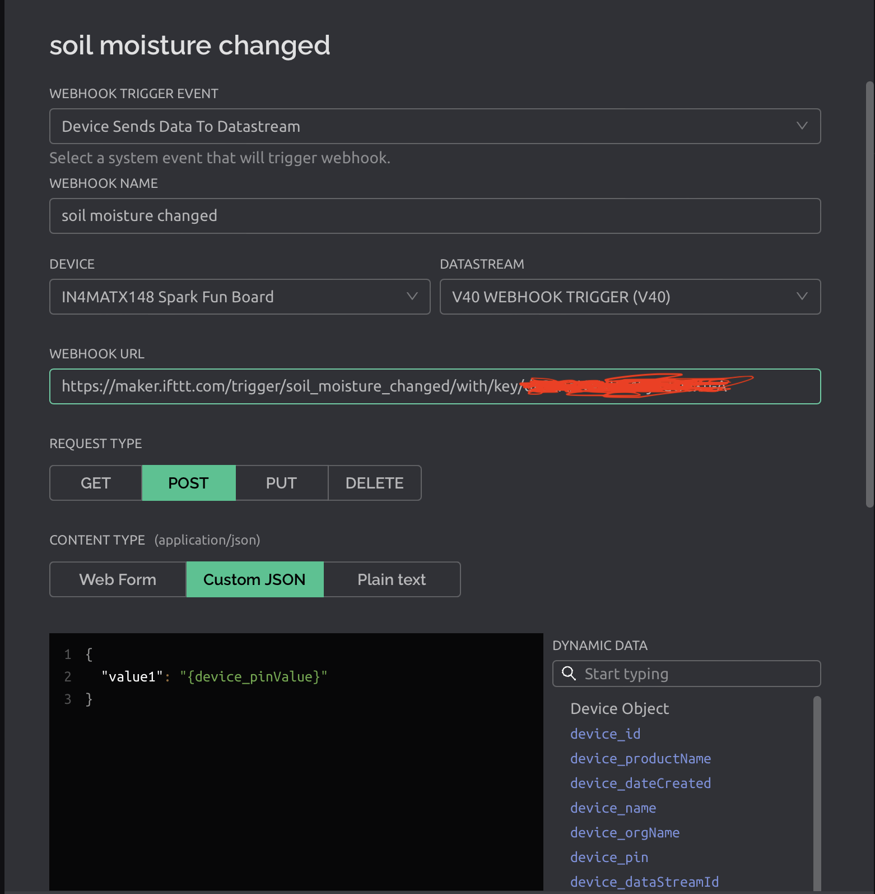

# Lecture 13

## Networks

- A collection of computers and devices that facilitate communication an

## Transports

- Physical and wireless means to get data around

## Protocols

- The languages machines use to talk to each other

### HTTP

- Asynchronous protocol
- One-way
- One client request and rules
- Data heavy; filled with headers and rules

### Rest

- 

### XML

- Markup language similar to HTML

### JSON

- Lightweight data-interchange

### MQTT

- 

### CoAP

## Trust and IoT

- Enormous diversity of hardware, OS, software, and manufactureres make it difficult oto establish standard IoT security and privacy-protecting solutions
- Basic security measures does not protect against these IoT botnet attacks, privacy threats

### Building trust in IoT

1) Social engineering
2) Attacks on hosted components
3) Hacked device software
4) Physical attack
5) Security misconfiguration

> There is no "magic bullet." Thinking about security before an IoT applicaiton is developed and deployed should be an integral part of the design

## Webhook

- Nearly all modern systems have their own Web/HTTP API

## Blynk Webhook

