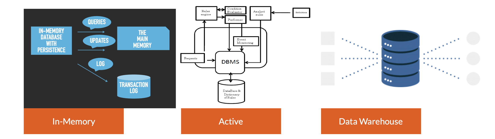
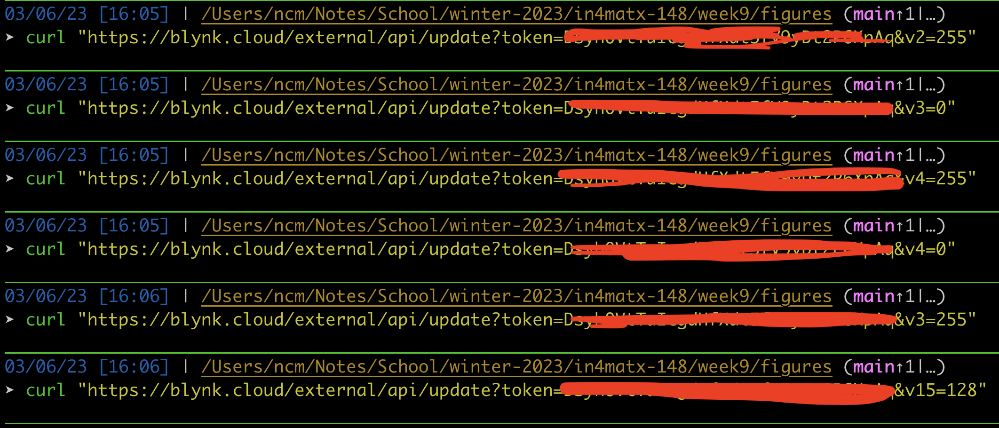
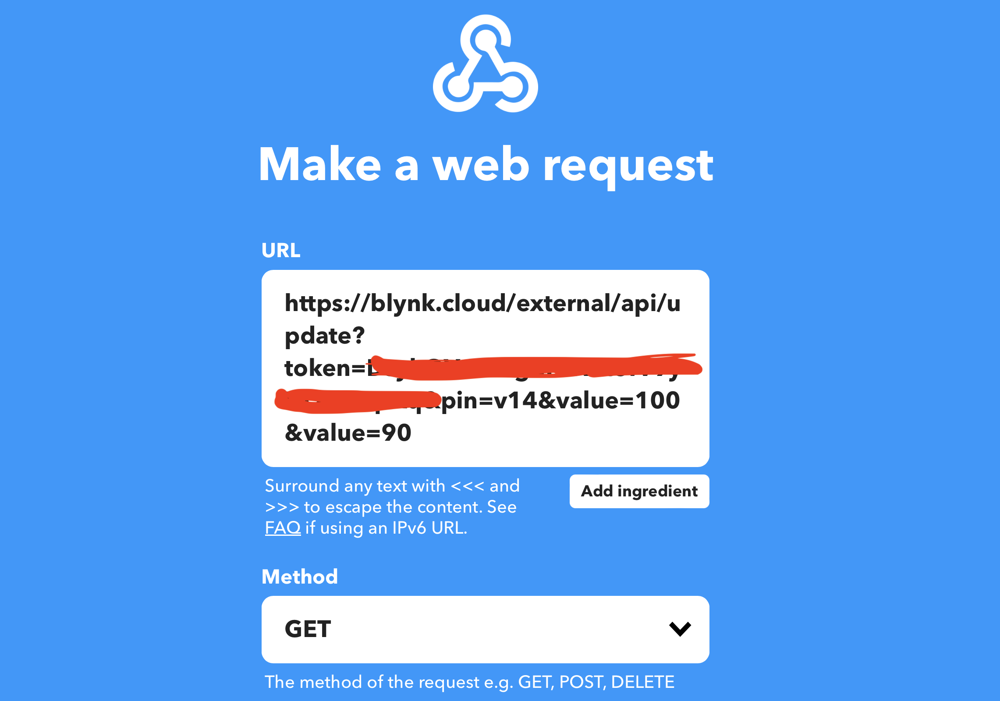

# Lecture 15

## Databases

### Proficiencies

- We create ~2.5 quintillion bytes of data daily, which  is accelerating at an exponential rate.
- More data has been collected in the past two years than in the entire human history. So where does all this data go? One of the foundational locations is a database.
- Without the database and ability to query the database, it would be nearly impossible to analyze any of that data in a meaningful way

### Management

- A database is a set of related data and the way it is organized. 
- Access to data is usually provided by a "database management system" (DBMS) consisting of an integrated set of computer software that allows users to interact with one or more databases.
- DBMS allows entry, storage and retrieval of large quantities of information and provides ways to manage how that information is organized.

### Implementations

### Storage types

## HTTP API

### Part 1

#### Read pin value

#### Update pin value

### Part 2

#### External invocation

#### IFTTT webhook

#### Blynk UI result

